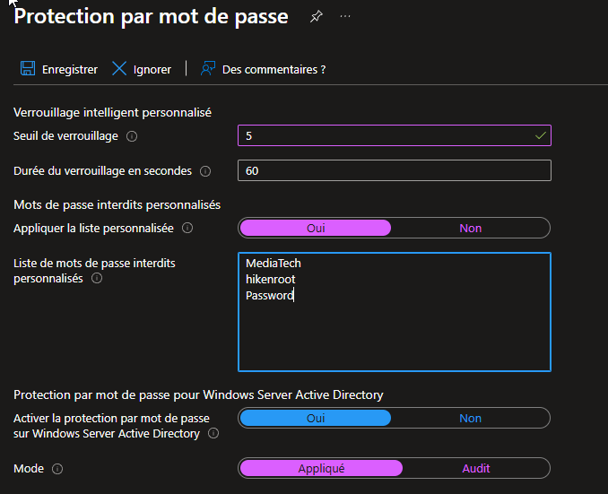
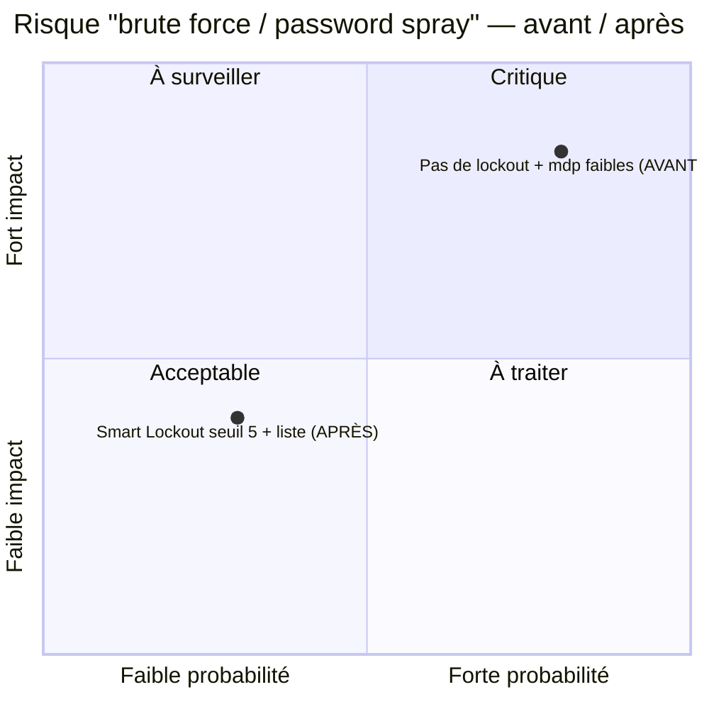

# SC-300-12 — Verrouillage intelligent & protection par mot de passe

## Classification

| Champ | Valeur |
|-------|--------|
| **Code scénario** | SC-300-12 |
| **Nom** | Configuration du Smart Lockout et de la liste de mots de passe interdits |
| **Type** | 🛡️ Défensif — Protection anti-brute force / password spray (Entra ID) |
| **Environnement** | Tenant Microsoft Entra `nchouarhipm.onmicrosoft.com` |
| **Domaine SC-300** | D2 (Authentication & access management) |
| **Module Entra** | Protection · Méthodes d'authentification · Protection par mot de passe |
| **Criticité opérationnelle** | 🟠 Élevée (protection des authentifications) |
| **Contrôles ISO 27001** | A.5.17 (Informations d'authentification), A.8.5 (Authentification sécurisée) |
| **Exigences NIS2** | Art. 21.2(i) — contrôle d'accès et authentification |
| **MITRE D3FEND** | D3-ANCI (Account Locking) · **Contre** T1110 (Brute Force), T1110.003 (Password Spraying) |
| **Réf. lab SC-300** | `Lab_12_ManageAzureADSmartLockoutValues` |
| **Date** | Août 2026 |
| **Auteur** | hik3nR00t |

---

## Contexte & scénario

> Les authentifications de **MediaTech Groupe SA** sont exposées aux attaques par **password spray** et **brute force** — techniques privilégiées contre les tenants cloud. Objectif : durcir la résistance en verrouillant les comptes après un faible nombre d'échecs, et en bannissant les mots de passe faibles ou prévisibles liés à l'organisation.

---

## Résumé exécutif

### Pour un recruteur

Ce write-up configure le **Smart Lockout** de Microsoft Entra (verrouillage après N échecs, durée de verrouillage) et une **liste de mots de passe interdits personnalisée** (termes liés à l'organisation), en mode **Appliqué**. Ces contrôles réduisent directement l'efficacité des attaques par brute force et password spray.

### Pour un auditeur ISO 27001 / NIS2

Le dispositif répond à l'exigence d'**authentification sécurisée** (A.8.5, A.5.17) : le verrouillage intelligent limite les tentatives, la liste de mots de passe interdits empêche l'usage de secrets faibles/devinables (nom de l'organisation, « Password »…). Ces contrôles sont **appliqués** (pas seulement en audit), donc effectifs.

### Pour un RSSI

Le risque adressé est le **password spray** — attaque n°1 contre Entra ID, où l'attaquant teste un mot de passe courant sur de nombreux comptes. Le Smart Lockout (seuil bas + verrouillage temporisé) et la liste interdite cassent cette technique sans bloquer les utilisateurs légitimes. Coût nul, gain de posture immédiat.

---

## Objectif & périmètre

Configurer le seuil et la durée de verrouillage, activer une liste de mots de passe interdits personnalisée, et appliquer la protection.

---

## Prérequis

- Rôle **Global Administrator** / **Security Administrator** / **Authentication Policy Administrator**.

---

## Procédure de mise en œuvre

> Session **breakglass01** (GA).

1. Recherche → **Protection par mot de passe** (`Protection → Méthodes d'authentification → Protection par mot de passe`).
2. **Seuil de verrouillage** = `5` (au lieu de 10 par défaut).
3. **Durée du verrouillage (secondes)** = `60`.
4. **Appliquer la liste personnalisée** = **Oui** → liste (un mot par ligne, ≤16 car.) :
   ```
   MediaTech
   hikenroot
   Password
   ```
5. **Mode** = **Appliqué** (Enforced, pas Audit).
6. **Enregistrer**.
   

> Un mot par ligne (pas de virgules) — Entra rejette les entrées > 16 caractères.

---

## Vérification & preuves d'audit

```
☐ Seuil de verrouillage = 5                                    → 01
☐ Liste personnalisée = Oui (1 mot/ligne)                      → 01
☐ Mode = Appliqué                                              → 01
☐ Test : 5 échecs d'auth → compte verrouillé 60 s
☐ Audit logs → tentatives bloquées / mot de passe rejeté
```

---

## Impact métier — MediaTech Groupe SA

### Synthèse narrative

MediaTech neutralise la principale technique d'entrée cloud (password spray) sans friction pour les utilisateurs légitimes. Un attaquant qui tente des mots de passe courants sur les comptes MediaTech se heurte au verrouillage, et les secrets faibles liés à l'orga sont bannis à la source.

### Estimation financière (évitement de risque)

| Poste | Sans Smart Lockout | Avec Smart Lockout + liste |
|-------|--------------------|-----------------------------|
| Compromission par password spray | vecteur d'entrée n°1 — remédiation lourde | technique cassée |
| Mots de passe faibles/devinables | acceptés | bannis à la création |
| Coût de la mesure | — | **0 €** |

### Matrice de risque



### Impact réglementaire

RGPD Art. 32, NIS2 Art. 21.2(i), ISO 27001 A.8.5 / A.5.17.

### Top actions

- **0–24 h** : Smart Lockout en mode Appliqué, seuil 5.
- **1 semaine** : liste interdite enrichie (termes métier, produits, ville).
- **1 mois** : coupler à Conditional Access (SC-300-13) + risk policies (SC-300-14).

### Décisions COMEX

- Valider la **politique anti-brute force** comme baseline de sécurité des accès.

---

## Détection SOC / SIEM

| Source | Événement | Intérêt |
|--------|-----------|---------|
| Sign-in logs | Échecs multiples même compte / IP | Brute force |
| Sign-in logs | Échecs sur nombreux comptes / même IP | **Password spray** |
| Sign-in logs | `50053` (compte verrouillé) | Smart Lockout déclenché |

```kusto
SigninLogs
| where ResultType in ("50126","50053")   // bad password / account locked
| summarize Tentatives=count() by IPAddress, bin(TimeGenerated, 1h)
| where Tentatives > 20
| order by Tentatives desc
```
> Beaucoup d'échecs depuis une IP sur des comptes variés = **password spray** → alerter.

---

## Durcissement continu — `m365-admin-toolkit`

| Contrôle | Script toolkit |
|----------|----------------|
| Vérifier les valeurs Smart Lockout (seuil/durée) | `audit-security-policies` |
| Vérifier mode Appliqué (vs Audit) | `audit-security-policies` |

- **0–24 h** : mode Appliqué confirmé.
- **1 mois** : corrélation SIEM password spray + réponse automatique.

---

## Points d'examen SC-300

- **Smart Lockout** : seuil par défaut 10, durée 60 s — abaisser le seuil durcit la protection.
- **Liste de mots de passe interdits** : 1 mot par ligne, ≤16 caractères ; Entra applique aussi une **liste globale** de mots de passe bannis.
- **Mode Appliqué** vs **Audit** : Audit journalise sans bloquer ; Appliqué bloque réellement.
- La protection par mot de passe peut s'étendre à **Windows Server AD** (agent DC) — hors périmètre cloud pur.

---

## Références

- [SC-300 Study Guide](https://learn.microsoft.com/en-us/credentials/certifications/resources/study-guides/sc-300)
- [Lab_12 Manage Smart Lockout Values](https://microsoftlearning.github.io/SC-300-Identity-and-Access-Administrator/Instructions/Labs/Lab_12_ManageAzureADSmartLockoutValues.html)
- [m365-admin-toolkit](https://github.com/hikenroot/m365-admin-toolkit)
