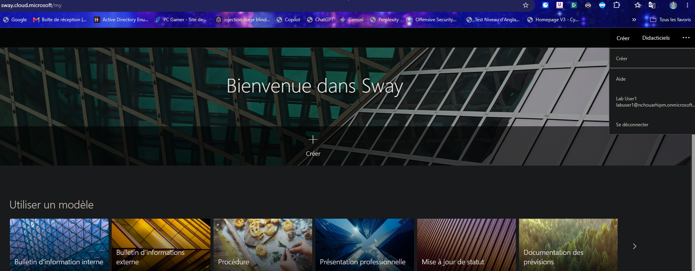
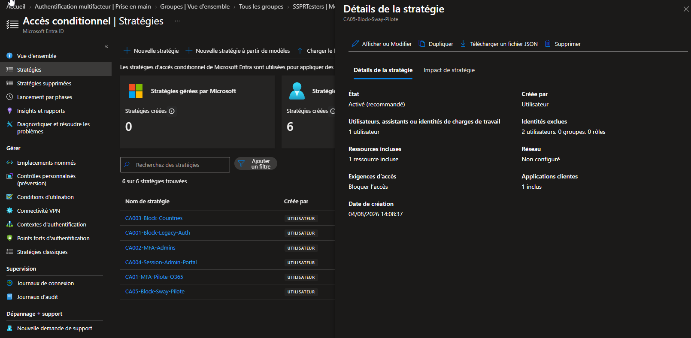
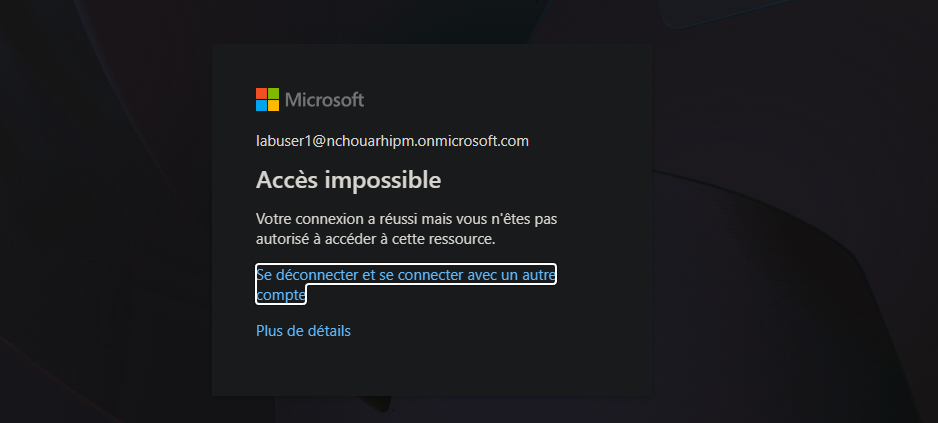
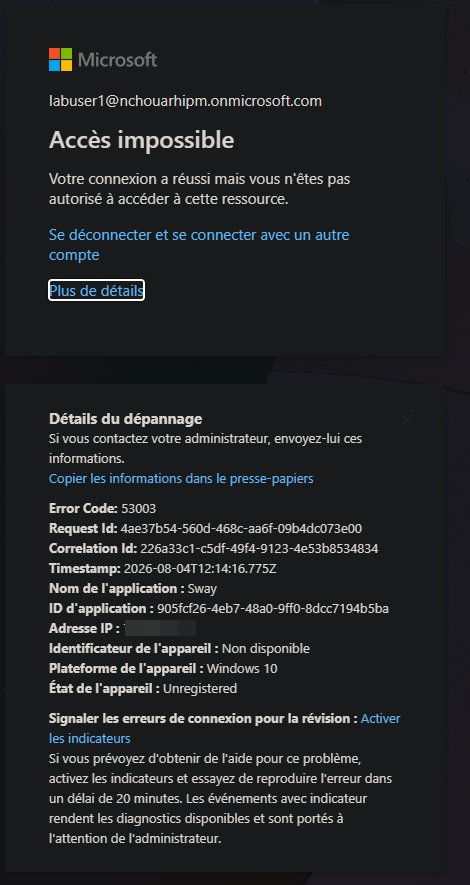
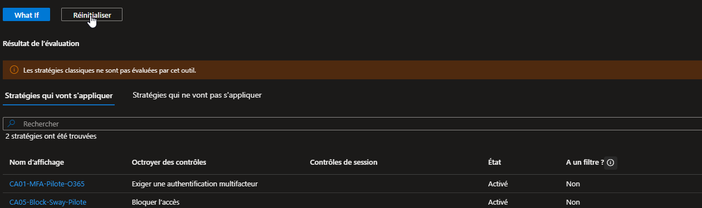
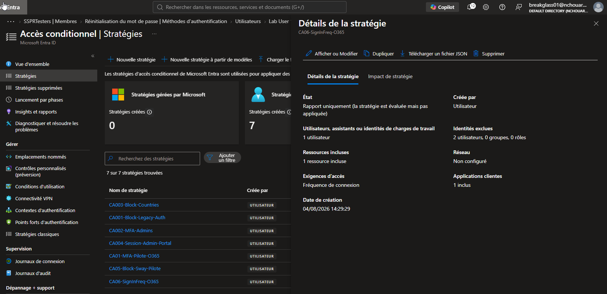

# SC-300-13 — Implement and Test a Conditional Access Policy

## 1. Classification

| Champ | Valeur |
|-------|--------|
| **Code** | SC-300-13 |
| **Type** | Lab de mise en œuvre — Accès conditionnel (blocage app + contrôle de session) |
| **Domaine SC-300** | D2 — Implémenter l'authentification et la gestion des accès (25-30%) |
| **Lab officiel** | `Lab_13_ImplementAndTestAConditionalAccessPolicy.md` (MicrosoftLearning/SC-300) |
| **ISO 27001:2022** | A.5.15 (Contrôle d'accès), A.8.2 (Accès privilégiés), A.8.5 (Authentification sécurisée) |
| **NIS2** | Art. 21.2(i)/(j) — contrôle d'accès et authentification |
| **MITRE D3FEND** | D3-ACH (Access Control Hardening), D3-UAP (User Account Permissions) |
| **MITRE ATT&CK (contré)** | T1078 (Valid Accounts), T1550 (Use Alternate Auth Material) — via blocage et re-auth périodique |
| **Tenant** | `nchouarhipm.onmicrosoft.com` · Entra ID P2 |
| **Auteur** | hik3nR00t |
| **Date** | 04/08/2026 |

---

## 2. Contexte & scénario — MediaTech Groupe SA

> *MediaTech Groupe SA veut un contrôle d'accès granulaire par application : interdire à certains profils l'usage d'apps non conformes à la politique interne (ex. publication externe via Sway), et raccourcir la durée de vie des sessions sur les services sensibles pour limiter le vol de token/session. Le RSSI exige que ces contrôles soient testables avant enforcement (mode Report-only + outil de simulation), et que les comptes d'urgence restent toujours exclus.*

Ce lab reproduit ces exigences : blocage applicatif ciblé (Sway), simulation via **What If**, et contrôle de session **fréquence de connexion** en Report-only.

---

## 3. Résumé exécutif

### Pour un recruteur
Mise en œuvre de stratégies d'accès conditionnel Microsoft Entra : blocage d'une application pour un utilisateur ciblé, simulation d'impact avant activation (What If), et contrôle de session imposant une ré-authentification périodique. Le déploiement illustre la précédence des contrôles (Bloquer l'emporte sur Octroyer), l'usage du mode Report-only pour un rollout sans risque, et l'exclusion systématique des comptes d'urgence.

### Pour un auditeur ISO 27001 / NIS2
- **A.5.15 (Contrôle d'accès)** : accès applicatif décidé par stratégie centralisée, pas au niveau de chaque app.
- **A.8.5** : le contrôle de session (fréquence de connexion) réduit la fenêtre d'exploitation d'une session volée.
- **Testabilité** : mode **Report-only** + outil **What If** permettent d'évaluer l'impact avant enforcement — traçabilité et gestion du changement conformes.
- **A.8.2 (Accès privilégiés)** : comptes break-glass exclus de toutes les stratégies (continuité d'accès d'urgence).
- **Preuve auditables** : blocage matérialisé côté annuaire (code `53003 — BlockedByConditionalAccess`) exploitable par le SOC.

### Pour un RSSI
Le CA transforme la politique d'accès en règles centralisées et auditables. Le blocage applicatif est non contournable (imposé à l'authentification, pas dans l'app). Le contrôle de fréquence de connexion limite la valeur d'un token volé en forçant une ré-authentification. What If et Report-only permettent de déployer sans casser la production. Généralisation MediaTech : cibler des groupes plutôt que des users, observer via Insights, puis basculer en enforcement.

---

## 4. Objectif & périmètre

Trois contrôles CA :
1. **Blocage applicatif** — interdire Sway à labuser1 (Block access).
2. **Simulation** — outil What If (labuser1 + Sway) : quelles stratégies s'appliquent.
3. **Contrôle de session** — fréquence de connexion 30 j sur Office 365 pour labuser2, en Report-only.

Exclusion systématique des 2 comptes break-glass.

**Hors périmètre** : filtres device/compliance (Intune), emplacements nommés, risk-based (Lab 14).

---

## 5. Prérequis

- Licence **Entra ID P1+** (P2 présent).
- Session **breakglass01** (Global Administrator).
- **Security Defaults = OFF**.
- Comptes de test : labuser1 (mot de passe connu), labuser2.
- Contexte : 5 stratégies CA préexistantes (dont `CA01-MFA-Pilote-O365` activée).

---

## 6. Procédure de mise en œuvre

> Session **breakglass01** · `entra.microsoft.com` · labels FR.

### 6.1 — Exercice 1 : bloquer Sway pour labuser1

**Baseline** — session labuser1 → `sway.cloud.microsoft` accessible.



**Stratégie** — `Accès conditionnel → + Nouvelle stratégie`
- Nom : `CA05-Block-Sway-Pilote`
- Utilisateurs : Inclure **labuser1** · Exclure **breakglass01 + breakglass02**
- Ressources : **Sway**
- Octroyer : **Bloquer l'accès**
- Activer : **Activé** → Créer.



**Test** — InPrivate → `sway.cloud.microsoft` → labuser1 → **Accès impossible** (« Votre connexion a réussi mais vous n'êtes pas autorisé à accéder à cette ressource »).



Détails du dépannage : **Error Code `53003` (BlockedByConditionalAccess)**, application = Sway.



### 6.2 — Exercice 2 : outil What If

`Accès conditionnel → Stratégies → What If` → Utilisateur **labuser1** · Ressource **Sway** · Plateforme Windows · App cliente Navigateur → **What If**.

Résultat : **2 stratégies s'appliquent** —
- `CA01-MFA-Pilote-O365` (Exiger MFA — Sway ∈ Office 365)
- `CA05-Block-Sway-Pilote` (Bloquer l'accès)

Le contrôle **Bloquer** l'emporte → accès refusé.



### 6.3 — Exercice 3 : contrôle de session (fréquence de connexion)

`Accès conditionnel → + Nouvelle stratégie`
- Nom : `CA06-SignInFreq-O365`
- Utilisateurs : Inclure **labuser2** · Exclure **breakglass01 + breakglass02**
- Ressources : **Office 365**
- Session : **Fréquence de connexion = 30 Jours**
- Activer : **Rapport uniquement** → Créer.



### 6.4 — Nettoyage post-lab

`CA05-Block-Sway-Pilote` → **Désactivé** après validation, pour rendre l'accès Sway à labuser1 (conforme au lab officiel).

---

## 7. Vérification & preuves d'audit

### Checklist

```
☐ CA05-Block-Sway-Pilote : Activé, Bloquer l'accès, cible Sway, labuser1 inclus
☐ breakglass01 + breakglass02 exclus de CA05 ET CA06
☐ Test Sway labuser1 = Accès impossible (Error 53003)
☐ What If : CA05 + CA01 applicables → Block prioritaire
☐ CA06-SignInFreq-O365 : Report-only, session 30 j, Office 365, labuser2
☐ Nettoyage : CA05 désactivée en fin de lab
```

### Vérification Graph PowerShell (pwsh)

```powershell
Connect-MgGraph -Scopes "Policy.Read.All","AuditLog.Read.All"

# 1. Stratégies CA du lab
Get-MgIdentityConditionalAccessPolicy |
  Where-Object DisplayName -in 'CA05-Block-Sway-Pilote','CA06-SignInFreq-O365' |
  Select-Object DisplayName, State,
    @{n='Grant';e={$_.GrantControls.BuiltInControls}},
    @{n='SessionSignInFreq';e={$_.SessionControls.SignInFrequency.Value}},
    @{n='SessionUnit';e={$_.SessionControls.SignInFrequency.Type}},
    @{n='Exclude';e={$_.Conditions.Users.ExcludeUsers}}

# 2. Preuve du blocage dans les sign-in logs (Error 53003)
Get-MgAuditLogSignIn -Top 10 `
  -Filter "userPrincipalName eq 'labuser1@nchouarhipm.onmicrosoft.com'" |
  Where-Object { $_.Status.ErrorCode -eq 53003 } |
  Select-Object CreatedDateTime, AppDisplayName,
    @{n='Error';e={$_.Status.ErrorCode}},
    @{n='Failure';e={$_.Status.FailureReason}}
```

Attendu : `CA05 State = enabled` / Grant = block, `CA06 State = enabledForReportingButNotEnforced` / SignInFreq = 30 days, break-glass dans Exclude, et un sign-in labuser1 avec `ErrorCode 53003`.

---

## 8. Impact métier — MediaTech Groupe SA

### Synthèse narrative
Le CA donne à MediaTech un contrôle d'accès applicatif fin et une réduction de la durée de vie des sessions sensibles, sans toucher au code des applications. Le mode Report-only et What If permettent de déployer sans incident, un prérequis pour une DSI qui ne peut pas se permettre de bloquer la rédaction.

### Estimation financière (risque évité)

| Scénario | Estimation | Justification |
|---|---|---|
| Fuite via app non conforme (Sway public) | 100 000 € – 500 000 € | Publication externe non maîtrisée de contenu interne |
| Exploitation d'un token/session volé | 150 000 € – 900 000 € | Fréquence de connexion réduit la fenêtre d'usage |
| Incident dû à un mauvais rollout CA | 50 000 € – 300 000 € | Évité par Report-only + What If |
| **Total risque évité** | **300 000 € – 1 700 000 €** | Coût de mise en œuvre nul (licence détenue) |

### Impact réglementaire
- **ISO 27001 A.5.15 / A.8.5** : contrôle d'accès et sécurité de session documentés.
- **NIS2 Art. 21** : mesures de contrôle d'accès effectives et testées.
- **RGPD Art. 32** : réduction du risque d'accès non autorisé prolongé.

### Top actions prioritaires
**0–24h** : (1) convertir les cibles user → **groupes** ; (2) vérifier l'exclusion break-glass sur toutes les CA.
**1 semaine** : (3) analyser l'impact de CA06 via *Insights et rapports* avant enforcement ; (4) documenter la matrice « qui a accès à quoi ».
**1 mois** : (5) basculer les CA Report-only pertinentes en enforcement ; (6) étendre les contrôles de session aux apps sensibles (SharePoint, Exchange).

### Décisions attendues du COMEX
- Valider la **politique d'accès applicatif** (quelles apps interdites à quels profils).
- Arbitrer la **durée de session** acceptable sur les services sensibles (sécurité vs friction).
- Financer l'observation Report-only avant enforcement généralisé.

---

## 9. Détection SOC / SIEM

### Signaux clés

| Source | Signal | Usage |
|---|---|---|
| `SigninLogs` | `ResultType 53003` | Accès bloqué par CA |
| `SigninLogs` | `ConditionalAccessStatus` | success / failure / notApplied |
| `SigninLogs` | `ConditionalAccessPolicies[].result` | Quelle policy a agi |
| `AuditLogs` | `Update/Delete conditional access policy` | Altération d'une CA (anti-tamper) |

### Requêtes KQL

```kql
// 1. Accès bloqués par Conditional Access (53003)
SigninLogs
| where ResultType == "53003"
| project TimeGenerated, UserPrincipalName, AppDisplayName, IPAddress, Location
| sort by TimeGenerated desc
```

```kql
// 2. Quelle stratégie CA bloque, et pour qui
SigninLogs
| mv-expand ca = ConditionalAccessPolicies
| where tostring(ca.result) == "failure"
| project TimeGenerated, UserPrincipalName, AppDisplayName,
          Policy = tostring(ca.displayName)
| summarize hits = count() by Policy, UserPrincipalName
| sort by hits desc
```

```kql
// 3. Anti-tamper : modification/suppression d'une stratégie CA
AuditLogs
| where OperationName has "conditional access policy"
| where OperationName has_any ("Update","Delete","Disable")
| project TimeGenerated, OperationName,
          Actor = tostring(InitiatedBy.user.userPrincipalName),
          Target = tostring(TargetResources[0].displayName)
| sort by TimeGenerated desc
```

---

## 10. Pièges rencontrés (terrain)

- **Précédence Bloquer > Octroyer** : What If montre 2 stratégies applicables (MFA + Block) ; c'est le **Block qui gagne**. Ne pas s'attendre à un prompt MFA quand un Block coexiste.
- **Sway ∈ Office 365** : la CA MFA sur « Office 365 » couvre aussi Sway → penser aux dépendances d'apps du bundle.
- **Session en cache** : un utilisateur déjà connecté ne voit pas le blocage immédiatement → tester en InPrivate neuf, attendre ~1 min (propagation).
- **What If exige plateforme + app cliente** : 2 champs obligatoires, sinon l'évaluation ne se lance pas.
- **Contrôle de session seul suffit** : une CA peut être créée avec un contrôle de Session (fréquence) sans contrôle d'Octroi.
- **Ne pas oublier le nettoyage** : la policy de blocage reste active tant qu'on ne la désactive pas → labuser1 resterait bloqué de Sway.

---

## 11. Durcissement continu

- Cibler des **groupes** (pas des users) et exclure un **groupe break-glass** unique et documenté.
- Passer les CA **Report-only → enforcement** après analyse d'impact (*Insights et rapports*).
- Étendre les **contrôles de session** (fréquence, non-persistance de navigateur) aux apps sensibles.
- Alerter le SOC sur les pics de `53003` (mauvaise config ou tentative d'accès non autorisé).
- Protéger les CA contre la modification (anti-tamper : alerte sur Update/Delete de policy).

> Cross-ref audit PowerShell : [`m365-admin-toolkit`](https://github.com/hikenroot/m365-admin-toolkit) — export et revue des stratégies CA, détection des CA sans exclusion break-glass. Cross-ref : [`ad-hardening-baseline`](https://github.com/hikenroot/ad-hardening-baseline).

---

## 12. Points d'examen SC-300

- **Bloquer l'accès l'emporte TOUJOURS** sur tout contrôle d'octroi (MFA, device compliant…). Piège de précédence classique.
- **Error 53003 = BlockedByConditionalAccess** — code de référence.
- **Report-only** : évalue et journalise sans imposer (résultats dans Sign-in logs + Insights). Idéal pour tester.
- **What If** : simule l'application des stratégies pour un user/app/condition donnés (plateforme + app cliente requises).
- **Fréquence de connexion** = contrôle de **Session**, force la ré-authentification périodique (mitige token theft).
- **Toujours exclure les comptes break-glass** de toute CA.
- Une CA valide requiert **au moins un** contrôle d'Octroi **ou** de Session.
- Les **stratégies classiques** (legacy) ne sont pas évaluées par What If.

---

## 13. Références

- Study Guide SC-300 — « Implement authentication and access management ».
- Lab officiel : `Lab_13_ImplementAndTestAConditionalAccessPolicy` — MicrosoftLearning/SC-300 · [github.io](https://microsoftlearning.github.io/SC-300-Identity-and-Access-Administrator/Instructions/Labs/Lab_13_ImplementAndTestAConditionalAccessPolicy.html)
- Docs : Conditional Access — policy components · What If tool · Sign-in frequency session controls · Sign-in error 53003.
- Toolkits : [`m365-admin-toolkit`](https://github.com/hikenroot/m365-admin-toolkit) · [`ad-hardening-baseline`](https://github.com/hikenroot/ad-hardening-baseline)

---

*Write-up HikenRoot Forge — SC-300-13 — hik3nR00t — 04/08/2026*
