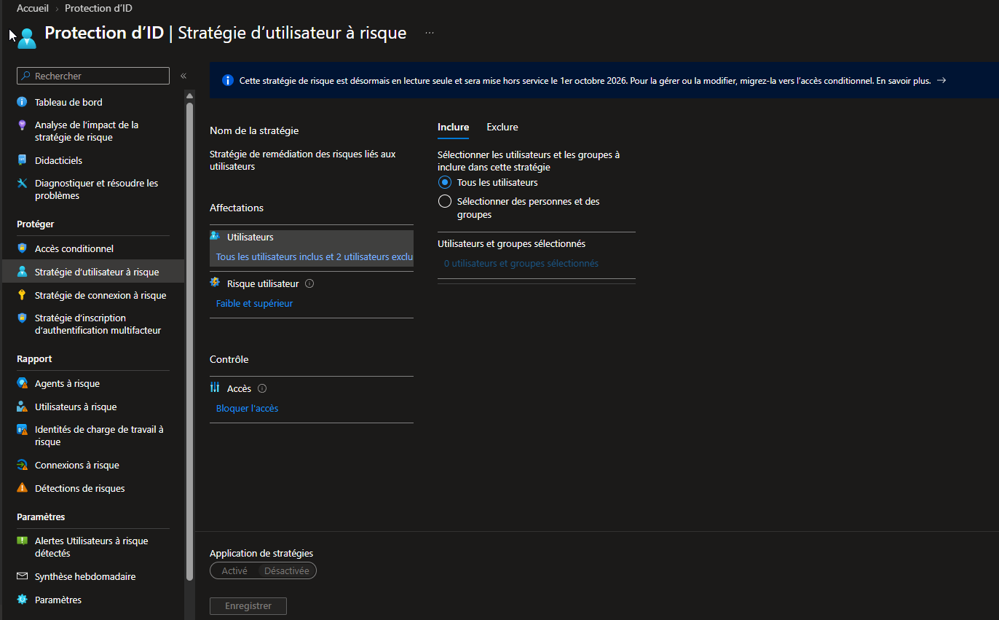
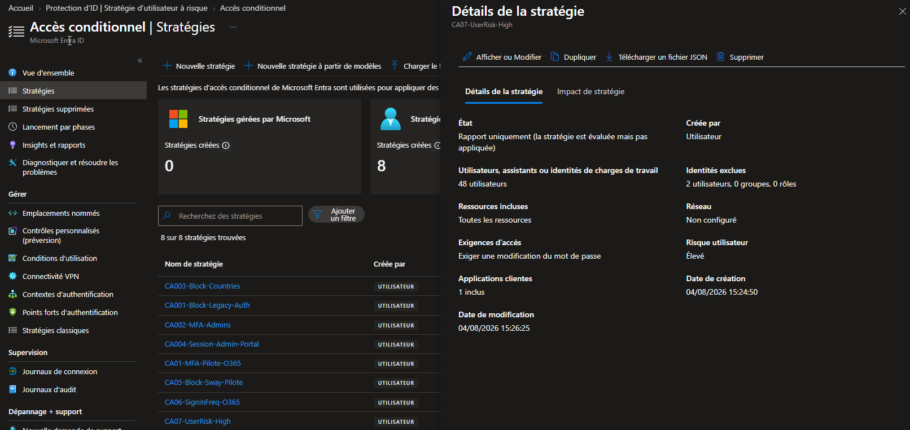
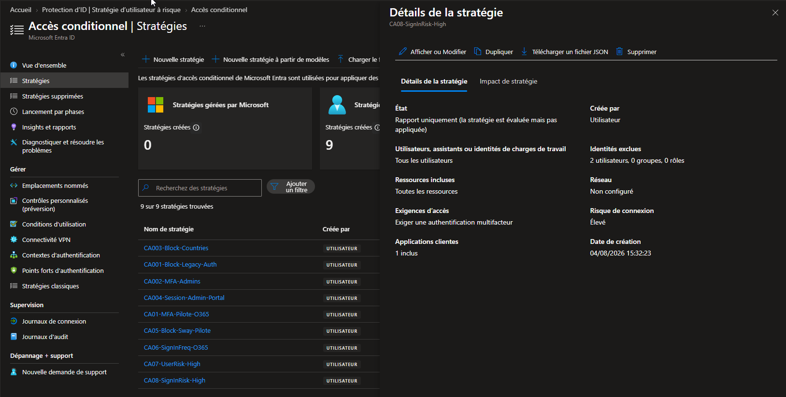

# SC-300-14 — Sign-in and User Risk Policies (Identity Protection)

## 1. Classification

| Champ | Valeur |
|-------|--------|
| **Code** | SC-300-14 |
| **Type** | Lab de mise en œuvre — Stratégies de risque (Identity Protection / Conditional Access) |
| **Domaine SC-300** | D2 — Implémenter l'authentification et la gestion des accès (25-30%) |
| **Lab officiel** | `Lab_14_EnableSignRiskPolicy.md` (MicrosoftLearning/SC-300) — **adapté** (blades legacy dépréciées) |
| **ISO 27001:2022** | A.5.7 (Threat intelligence), A.8.16 (Surveillance des activités), A.5.15 (Contrôle d'accès) |
| **NIS2** | Art. 21.2(a)/(j) — analyse des risques, authentification renforcée |
| **MITRE D3FEND** | D3-ANCI (Authentication Event Thresholding), D3-UBA (User Behavior Analysis) |
| **MITRE ATT&CK (détecté/contré)** | T1078 (Valid Accounts), T1110 (Brute Force), T1550 (Alternate Auth Material) |
| **Tenant** | `nchouarhipm.onmicrosoft.com` · Entra ID **P2** (obligatoire) |
| **Auteur** | hik3nR00t |
| **Date** | 04/08/2026 |

---

## 2. Contexte & scénario — MediaTech Groupe SA

> *MediaTech Groupe SA veut une défense adaptative : réagir automatiquement quand Microsoft détecte un comportement anormal (connexion depuis une IP anonyme/Tor, voyage impossible, identifiants trouvés dans une fuite). Le RSSI demande deux réponses graduées — forcer un changement de mot de passe si le compte est présumé compromis (risque utilisateur élevé), et imposer un MFA si la connexion elle-même est suspecte (risque de connexion élevé) — sans jamais verrouiller les comptes d'urgence.*

Ce lab configure ces deux réponses automatiques via **Identity Protection**, en tenant compte de la dépréciation des stratégies de risque legacy (voir §10).

---

## 3. Résumé exécutif

### Pour un recruteur
Mise en place de la protection basée sur le risque de Microsoft Entra (Identity Protection, P2) : réponse automatique aux comptes présumés compromis (changement de mot de passe forcé) et aux connexions suspectes (MFA imposé). Le déploiement intègre la réalité 2026 — les anciennes stratégies de risque étant en lecture seule (retrait 01/10/2026), tout est implémenté via **Conditional Access** avec conditions de risque, la méthode désormais recommandée par Microsoft.

### Pour un auditeur ISO 27001 / NIS2
- **A.5.7 / A.8.16** : exploitation du renseignement sur les menaces (Microsoft détecte fuite de credentials, IP anonymes, voyage impossible) pour déclencher une remédiation automatique.
- **NIS2 Art. 21.2(a)** : gestion des risques opérationnalisée — la détection déclenche une action (changement mdp / MFA) sans intervention manuelle.
- **A.5.15** : contrôle d'accès adaptatif au niveau de risque, pas binaire.
- **Comptes d'urgence** : break-glass exclus des deux stratégies (continuité d'accès).
- **Approche graduée** : risque utilisateur (compte compromis) → changement mdp ; risque de connexion (session suspecte) → MFA. Deux plans distincts.

### Pour un RSSI
La protection basée sur le risque transforme la détection en réponse automatique, réduisant le temps d'exposition d'un compte compromis à quasi zéro. Sur ce tenant, les stratégies de risque héritées étant en fin de vie, l'implémentation via Conditional Access est à la fois obligatoire et pérenne. Le risque utilisateur est enforced (changement mdp), le risque de connexion en Report-only le temps de calibrer le taux de faux positifs.

---

## 4. Objectif & périmètre

Deux réponses automatiques basées sur le risque :
1. **Risque utilisateur élevé** → **Exiger le changement de mot de passe** (compte présumé compromis).
2. **Risque de connexion élevé** → **Exiger MFA** (session suspecte).

Implémentation via **Conditional Access** (conditions de risque), comptes break-glass exclus.

**Hors périmètre** : investigation des détections (Risky users/sign-ins reporting), intégration Sentinel (Lab 27 / SC-200), remédiation automatique via API.

---

## 5. Prérequis

- Licence **Entra ID P2** — **obligatoire** pour les stratégies de risque (P1 ne suffit pas).
- Session **breakglass01** (Global Administrator).
- Security Defaults = OFF.

---

## 6. Procédure de mise en œuvre

> Session **breakglass01** · `entra.microsoft.com` · labels FR.

### 6.0 — Constat terrain : blades legacy en lecture seule

`Entra ID → Protection → Identity Protection → Stratégie d'utilisateur à risque`

Bandeau : *« Cette stratégie de risque est désormais en **lecture seule** et sera **mise hors service le 1er octobre 2026**. Pour la gérer ou la modifier, **migrez-la vers l'accès conditionnel**. »* → bouton **Enregistrer grisé**.



**Conséquence** : le lab officiel (qui configure ces blades) n'est plus applicable. Implémentation via **Conditional Access**.

### 6.1 — CA07 : risque utilisateur élevé → changement de mot de passe

`Accès conditionnel → + Nouvelle stratégie`
- Nom : `CA07-UserRisk-High`
- Utilisateurs : Inclure tous les users · **Exclure breakglass01 + breakglass02**
- Ressources : **Toutes les ressources**
- Conditions → **Risque utilisateur = Élevé**
- Octroyer → **Exiger le changement de mot de passe** (implique MFA)
- Activer : **Activé**



### 6.2 — CA08 : risque de connexion élevé → MFA

`Accès conditionnel → + Nouvelle stratégie`
- Nom : `CA08-SignInRisk-High`
- Utilisateurs : Inclure tous les users · **Exclure breakglass01 + breakglass02**
- Ressources : **Toutes les ressources**
- Conditions → **Risque de connexion = Élevé**
- Octroyer → **Exiger l'authentification multifacteur**
- Activer : **Rapport uniquement** (calibrage des faux positifs avant enforcement)



---

## 7. Vérification & preuves d'audit

### Checklist

```
☐ Constat legacy read-only documenté (retrait 01/10/2026)
☐ CA07-UserRisk-High : Activé, condition Risque utilisateur = Élevé, Exiger changement mdp
☐ CA08-SignInRisk-High : Report-only, condition Risque connexion = Élevé, Exiger MFA
☐ breakglass01 + breakglass02 exclus des DEUX stratégies
☐ Ressources = Toutes les ressources
```

### Vérification Graph PowerShell (pwsh)

```powershell
Connect-MgGraph -Scopes "Policy.Read.All","IdentityRiskyUser.Read.All","IdentityRiskEvent.Read.All"

# 1. Stratégies CA de risque
Get-MgIdentityConditionalAccessPolicy |
  Where-Object DisplayName -in 'CA07-UserRisk-High','CA08-SignInRisk-High' |
  Select-Object DisplayName, State,
    @{n='UserRisk';e={$_.Conditions.UserRiskLevels}},
    @{n='SignInRisk';e={$_.Conditions.SignInRiskLevels}},
    @{n='Grant';e={$_.GrantControls.BuiltInControls}},
    @{n='Exclude';e={$_.Conditions.Users.ExcludeUsers}}

# 2. Utilisateurs à risque détectés
Get-MgRiskyUser -Top 20 |
  Select-Object UserPrincipalName, RiskLevel, RiskState, RiskLastUpdatedDateTime

# 3. Détections de risque récentes
Get-MgRiskDetection -Top 20 |
  Select-Object DetectedDateTime, RiskEventType, RiskLevel, IpAddress,
    @{n='User';e={$_.UserPrincipalName}}
```

Attendu : `CA07 State = enabled` (UserRisk=high, grant=passwordChange+mfa), `CA08 State = enabledForReportingButNotEnforced` (SignInRisk=high, grant=mfa), break-glass dans Exclude.

---

## 8. Impact métier — MediaTech Groupe SA

### Synthèse narrative
La protection basée sur le risque réduit à quasi zéro le délai entre la compromission d'un compte et la réponse : Microsoft détecte, la stratégie remédie automatiquement (reset ou MFA). Pour MediaTech, c'est une défense adaptative qui ne dépend pas de la vigilance humaine.

### Estimation financière (risque évité)

| Scénario | Estimation | Justification |
|---|---|---|
| Compte compromis exploité (BEC, exfiltration) | 200 000 € – 1 200 000 € | Reset automatique coupe l'accès de l'attaquant |
| Connexion frauduleuse depuis IP anonyme/pays inhabituel | 100 000 € – 600 000 € | MFA bloque la session sans le 2e facteur |
| Credentials issus d'une fuite (leaked credentials) | 50 000 € – 400 000 € | Détection Microsoft + reset forcé |
| **Total risque évité** | **350 000 € – 2 200 000 €** | Requiert P2 (déjà détenu) |

### Impact réglementaire
- **NIS2 Art. 21.2(a)** : gestion des risques opérationnalisée et automatisée.
- **ISO 27001 A.5.7 / A.8.16** : renseignement sur les menaces et surveillance exploités.
- **RGPD Art. 32** : mesure technique adaptative de protection des accès.

### Top actions prioritaires
**0–24h** : (1) vérifier que les comptes admin critiques sont couverts ; (2) confirmer l'exclusion break-glass.
**1 semaine** : (3) observer CA08 (sign-in risk) en Report-only, mesurer les faux positifs via *Insights* ; (4) configurer les notifications « Utilisateurs à risque détectés ».
**1 mois** : (5) basculer CA08 en enforcement ; (6) ajouter un niveau **Moyen et supérieur** si le volume de détections le justifie ; (7) intégrer les détections à Sentinel (SC-200).

### Décisions attendues du COMEX
- Valider l'**enforcement automatique** (reset/MFA) et son impact utilisateur potentiel.
- Arbitrer le **seuil de risque** (Élevé seul vs Moyen et supérieur).
- Financer l'intégration **SIEM** des signaux Identity Protection.

---

## 9. Détection SOC / SIEM

### Signaux clés

| Source | Signal | Usage |
|---|---|---|
| `AADUserRiskEvents` | `riskEventType` (leakedCredentials, anonymizedIPAddress…) | Type de détection |
| `SigninLogs` | `riskLevelDuringSignIn` | Risque évalué à la connexion |
| `SigninLogs` | `riskState` (atRisk / remediated / dismissed) | Cycle de vie du risque |
| `AuditLogs` | remédiation (password change forcé) | Preuve d'action automatique |

### Requêtes KQL

```kql
// 1. Connexions à risque élevé
SigninLogs
| where RiskLevelDuringSignIn == "high"
| project TimeGenerated, UserPrincipalName, AppDisplayName, IPAddress, Location,
          RiskState, RiskEventTypes = RiskEventTypes_V2
| sort by TimeGenerated desc
```

```kql
// 2. Types de détections de risque (leaked creds, IP anonyme, voyage impossible)
AADUserRiskEvents
| summarize count() by RiskEventType, RiskLevel
| sort by count_ desc
```

```kql
// 3. Comptes à risque non remédiés (à investiguer en priorité)
AADUserRiskEvents
| where RiskState == "atRisk" and RiskLevel == "high"
| summarize LastSeen = max(TimeGenerated), Events = count() by UserPrincipalName
| sort by LastSeen desc
```

---

## 10. Pièges rencontrés (terrain)

- **Blades de risque legacy en LECTURE SEULE** : sur ce tenant, `Stratégie d'utilisateur à risque` et `Stratégie de connexion à risque` sont bloquées (bouton Enregistrer grisé), **retrait 01/10/2026**. Le lab officiel est donc obsolète sur ce point — implémentation via **Conditional Access** obligatoire.
- **Risque utilisateur ≠ Risque de connexion** : le premier évalue la probabilité que le **compte** soit compromis (fuite de credentials…), le second la **session** courante (IP anonyme, voyage impossible). Contrôles de remédiation différents (reset mdp vs MFA).
- **Exiger le changement de mot de passe implique MFA** : Entra coche automatiquement MFA — normal, le reset doit être fait de façon vérifiée.
- **P2 obligatoire** : sans P2, pas de détection de risque ni de ces conditions dans CA.
- **Exclusion break-glass critique** : un compte d'urgence flaggé « à risque » se verrouillerait tout seul (reset/MFA imposé) — d'où l'exclusion systématique.

---

## 11. Durcissement continu

- Migrer **toutes** les stratégies de risque héritées vers Conditional Access avant le 01/10/2026.
- Basculer CA08 (sign-in risk) de Report-only vers enforcement après calibrage.
- Activer les notifications **Utilisateurs à risque détectés** + **synthèse hebdomadaire**.
- Combiner avec le durcissement des méthodes (FIDO2) pour une remédiation phishing-resistant.
- Intégrer les détections Identity Protection au **SIEM** (Sentinel — SC-200) pour corrélation.

> Cross-ref audit PowerShell : [`m365-admin-toolkit`](https://github.com/hikenroot/m365-admin-toolkit) — export des stratégies CA de risque et revue des utilisateurs à risque. Cross-ref : [`ad-hardening-baseline`](https://github.com/hikenroot/ad-hardening-baseline).

---

## 12. Points d'examen SC-300

- **Identity Protection exige P2** (pas P1).
- **Risque utilisateur** (compte compromis) → remédiation type **changement de mot de passe**. **Risque de connexion** (session suspecte) → remédiation type **MFA**.
- Niveaux de risque : **Faible / Moyen / Élevé** (choisir « X et supérieur »).
- Les **stratégies de risque héritées sont dépréciées** → configuration via **Conditional Access** (conditions User risk / Sign-in risk). Point d'actualité fréquemment mis à jour dans l'exam.
- **Toujours exclure les comptes break-glass**.
- Détections exemples : leaked credentials, anonymized IP (Tor), impossible travel, atypical location.
- **Report-only** utile pour mesurer les faux positifs avant enforcement.

---

## 13. Références

- Study Guide SC-300 — « Implement authentication and access management ».
- Lab officiel : `Lab_14_EnableSignRiskPolicy` — MicrosoftLearning/SC-300 · [github.io](https://microsoftlearning.github.io/SC-300-Identity-and-Access-Administrator/Instructions/Labs/Lab_14_EnableSignRiskPolicy.html)
- Docs : Microsoft Entra ID Protection — risk policies · Migrate risk policies to Conditional Access · Risk detections reference.
- Toolkits : [`m365-admin-toolkit`](https://github.com/hikenroot/m365-admin-toolkit) · [`ad-hardening-baseline`](https://github.com/hikenroot/ad-hardening-baseline)

---

*Write-up HikenRoot Forge — SC-300-14 — hik3nR00t — 04/08/2026*
