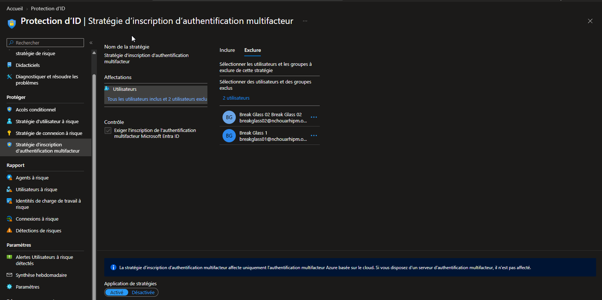
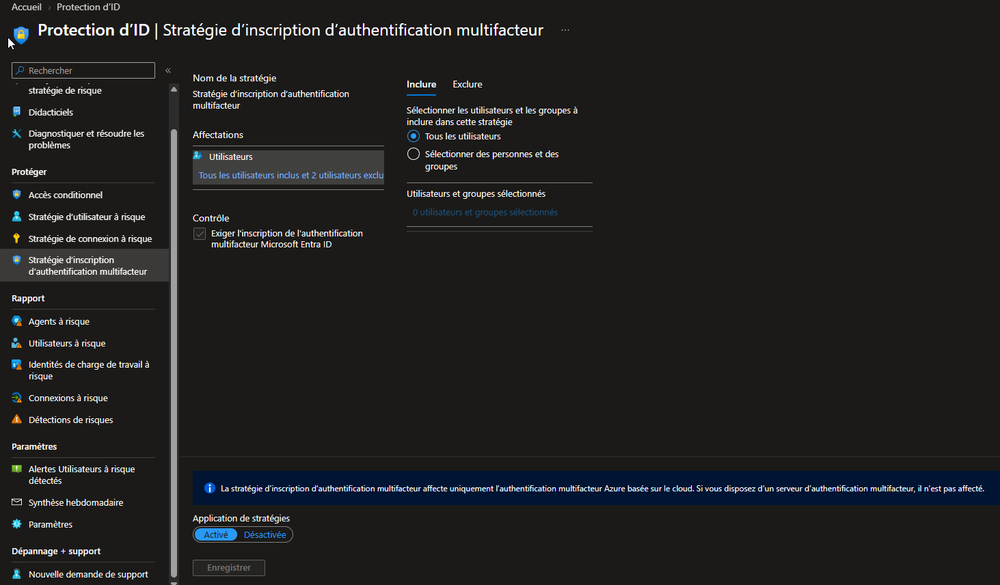

# SC-300-15 — Configure an MFA Registration Policy

## 1. Classification

| Champ | Valeur |
|-------|--------|
| **Code** | SC-300-15 |
| **Type** | Lab de mise en œuvre — Stratégie d'inscription MFA (Identity Protection) |
| **Domaine SC-300** | D2 — Implémenter l'authentification et la gestion des accès (25-30%) |
| **Lab officiel** | `Lab_15_ConfigureAAD_MultiFactorAuthRegPolicy.md` (MicrosoftLearning/SC-300) |
| **ISO 27001:2022** | A.5.17 (Informations d'authentification), A.8.5 (Authentification sécurisée) |
| **NIS2** | Art. 21.2(j) — recours effectif à la MFA (couverture d'enrôlement) |
| **MITRE D3FEND** | D3-MFA (Multi-factor Authentication) |
| **MITRE ATT&CK (contré)** | T1078 (Valid Accounts), T1621 (MFA Request Generation) |
| **Tenant** | `nchouarhipm.onmicrosoft.com` · Entra ID **P2** (obligatoire) |
| **Auteur** | hik3nR00t |
| **Date** | 04/08/2026 |

---

## 2. Contexte & scénario — MediaTech Groupe SA

> *Après avoir imposé le MFA (SC-300-08) et configuré les stratégies de risque (SC-300-14), MediaTech Groupe SA constate un angle mort : ces contrôles ne servent à rien pour un utilisateur qui n'a jamais enregistré de méthode MFA — il sera bloqué ou dépanné par le helpdesk au pire moment. Le RSSI veut garantir que 100 % des collaborateurs enregistrent leurs méthodes de façon proactive, dans une fenêtre bornée, avant qu'une exigence MFA ne se déclenche.*

Ce lab impose l'**inscription MFA** à tous les utilisateurs (période de grâce 14 jours), avec exclusion des comptes d'urgence.

---

## 3. Résumé exécutif

### Pour un recruteur
Mise en place de la stratégie d'inscription MFA de Microsoft Entra (Identity Protection, P2) : elle force chaque utilisateur à enregistrer ses méthodes d'authentification forte de façon proactive, dans une fenêtre de 14 jours, avant qu'une exigence MFA ne survienne. C'est le complément indispensable des stratégies MFA/risque : il garantit que les utilisateurs sont prêts, supprimant l'enrôlement en urgence au support.

### Pour un auditeur ISO 27001 / NIS2
- **A.5.17 / A.8.5** : garantie de couverture des méthodes d'authentification forte sur l'ensemble du parc.
- **NIS2 Art. 21.2(j)** : le recours à la MFA n'est effectif que si les méthodes sont enregistrées — cette stratégie rend la couverture mesurable et complète.
- **Contrôle non modifiable** : « Exiger l'inscription MFA Microsoft Entra » — pas de dérive de configuration possible.
- **Comptes d'urgence exclus** : break-glass sur méthodes dédiées (FIDO2/hardware), non soumis à l'enrôlement de masse.

### Pour un RSSI
Cette stratégie ferme l'angle mort de l'enrôlement : sans elle, une exigence MFA (CA ou risque) tombe sur des utilisateurs non préparés → friction, tickets, contournements. Avec 14 jours de grâce, le déploiement est absorbable sans choc. À l'échelle MediaTech, elle garantit que l'ensemble du parc est prêt avant tout durcissement supplémentaire.

---

## 4. Objectif & périmètre

Activer la **stratégie d'inscription MFA** pour **tous les utilisateurs** (hors break-glass), afin de forcer l'enregistrement des méthodes MFA sous 14 jours.

**Hors périmètre** : choix des méthodes disponibles (Authentication methods policy — SC-300-08), campagne d'inscription « nudge » (Registration campaign — alternative moderne, voir §11), SSPR (SC-300-09).

---

## 5. Prérequis

- Licence **Entra ID P2** — obligatoire (la stratégie d'inscription MFA fait partie d'Identity Protection).
- Session **breakglass01** (Global Administrator).
- Méthodes d'auth actives dans la stratégie de méthodes (Authenticator — cf. SC-300-08).

---

## 6. Procédure de mise en œuvre

> Session **breakglass01** · `entra.microsoft.com` · labels FR.

### 6.1 — Ouvrir la stratégie

`Entra ID → Protection → Identity Protection → (Protéger) Stratégie d'inscription d'authentification multifacteur`

> Contrairement aux stratégies de **risque** (SC-300-14) qui sont en lecture seule/dépréciées, cette blade est **éditable** — pas de bandeau de retrait.

### 6.2 — Configurer les affectations

- **Inclure** : **Tous les utilisateurs**.
- **Exclure** : **breakglass01 + breakglass02** (comptes d'urgence sur FIDO2/hardware, non soumis à l'enrôlement de masse).



### 6.3 — Contrôle (non modifiable)

- **Exiger l'inscription de l'authentification multifacteur Microsoft Entra ID** : coché, **non configurable** (c'est l'unique action de cette stratégie).

### 6.4 — Activer et enregistrer

- **Application de stratégies** : **Activé**.
- **Enregistrer**.



### 6.5 — Comportement attendu

À la prochaine connexion, un utilisateur **non encore enrôlé** se voit présenter l'assistant **« Plus d'informations requises »** → **« Ne perdez pas l'accès à votre compte »**, avec **14 jours** pour finaliser l'enregistrement (report possible pendant la grâce, obligatoire ensuite).

> Note test : labuser1 et labuser2 étant déjà enrôlés (SC-300-08/09), ils ne déclenchent pas le prompt. Un compte non enrôlé (ex. arya.stark) le déclencherait.

---

## 7. Vérification & preuves d'audit

### Checklist

```
☐ Stratégie d'inscription MFA = Application Activé
☐ Inclure = Tous les utilisateurs
☐ Exclure = breakglass01 + breakglass02
☐ Contrôle = Exiger l'inscription MFA (verrouillé)
☐ Un user non enrôlé obtient l'assistant d'inscription (grâce 14 j)
```

### Vérification Graph PowerShell (pwsh)

```powershell
Connect-MgGraph -Scopes "Policy.Read.All","Reports.Read.All"

# 1. Couverture d'enregistrement MFA sur le parc
Get-MgReportAuthenticationMethodUserRegistrationDetail |
  Select-Object UserPrincipalName, IsMfaRegistered, IsMfaCapable, MethodsRegistered |
  Sort-Object IsMfaRegistered

# 2. Taux global d'enregistrement (KPI de la stratégie)
$all = Get-MgReportAuthenticationMethodUserRegistrationDetail
"{0}/{1} users MFA-registered ({2}%)" -f `
  ($all | Where-Object IsMfaRegistered).Count, $all.Count,
  [math]::Round(100*($all | Where-Object IsMfaRegistered).Count/$all.Count,1)
```

Attendu : la proportion `IsMfaRegistered = true` progresse vers 100 % pendant la fenêtre de grâce ; les break-glass peuvent rester non enrôlés (exclus).

---

## 8. Impact métier — MediaTech Groupe SA

### Synthèse narrative
La stratégie d'inscription garantit que les contrôles MFA/risque déjà en place produisent réellement leur effet : un parc entièrement enrôlé ne subit ni blocage surprise ni enrôlement d'urgence au support. C'est le maillon qui rend la MFA opérationnelle à 100 %.

### Estimation financière (valeur / risque évité)

| Poste | Estimation | Justification |
|---|---|---|
| Réduction des tickets d'enrôlement d'urgence | 20 000 € – 80 000 € | Enrôlement proactif vs blocage au support |
| Risque d'ATO sur comptes non protégés évité | 100 000 € – 700 000 € | Un compte sans MFA = maillon faible exploitable |
| Continuité opérationnelle (pas de blocage surprise) | 20 000 € – 60 000 € | Aucun collaborateur bloqué par une exigence MFA non préparée |
| **Total valeur** | **140 000 € – 840 000 €** | Coût nul (licence P2 détenue) |

### Impact réglementaire
- **NIS2 Art. 21.2(j)** : recours à la MFA rendu **effectif et complet** (couverture mesurable).
- **ISO 27001 A.8.5** : authentification sécurisée garantie sur l'ensemble du parc.

### Top actions prioritaires
**0–24h** : (1) communiquer la fenêtre de 14 jours aux collaborateurs.
**1 semaine** : (2) suivre le taux d'enregistrement (Graph/rapport) ; (3) relancer les retardataires.
**1 mois** : (4) viser 100 % enrôlés ; (5) évaluer la **campagne d'inscription** (nudge Authenticator) et le passage au phishing-resistant (FIDO2).

### Décisions attendues du COMEX
- Valider la **fenêtre de grâce** et le plan de communication.
- Arbitrer le passage à des méthodes **phishing-resistant** une fois le parc enrôlé.

---

## 9. Détection SOC / SIEM

### Signaux clés

| Source | Signal | Usage |
|---|---|---|
| `AuditLogs` | `User registered security info` | Enrôlement d'une méthode |
| `AuditLogs` | `User started security info registration` | Début d'enrôlement |
| Rapport | `UserRegistrationDetails` | KPI de couverture |

### Requêtes KQL

```kql
// 1. Enrôlements de méthodes MFA (suivi de la campagne)
AuditLogs
| where ActivityDisplayName has "security info"
| where ActivityDisplayName has_any ("registered security info","started security info")
| project TimeGenerated, ActivityDisplayName,
          User = tostring(TargetResources[0].userPrincipalName), Result
| sort by TimeGenerated desc
```

```kql
// 2. Comptes sans inscription MFA — PAS de table Sentinel native pour ce KPI.
//    La couverture d'enregistrement vient du rapport Graph :
//    Get-MgReportAuthenticationMethodUserRegistrationDetail (cf. §7)
//    ou API reports/authenticationMethods/userRegistrationDetails.
//    Pour l'exploiter dans Sentinel : ingérer ce rapport dans une Watchlist, puis :
_GetWatchlist('MfaRegistration')
| where isMfaRegistered == "false" and UserPrincipalName !startswith "breakglass"
| project UserPrincipalName
```

---

## 10. Pièges rencontrés (terrain)

- **Ne pas confondre avec les stratégies de risque** : la stratégie d'inscription MFA est dans Identity Protection mais **reste éditable** (pas de dépréciation comme les risk policies SC-300-14).
- **Contrôle verrouillé** : « Exiger l'inscription MFA » est la seule action, non modifiable — normal.
- **Grâce de 14 jours** : l'utilisateur peut reporter pendant 14 jours, puis l'enrôlement devient bloquant. Ne pas s'attendre à un blocage immédiat.
- **Users déjà enrôlés = pas de prompt** : tester avec un compte vierge de méthode.
- **Exclusion break-glass** : les comptes d'urgence ne doivent pas être soumis à l'enrôlement de masse (méthodes dédiées FIDO2/hardware).

---

## 11. Durcissement continu

- Suivre le **taux d'enrôlement** (Graph) jusqu'à 100 % hors break-glass.
- Compléter par une **campagne d'inscription** (Authentication methods → Registration campaign) qui *nudge* les utilisateurs vers **Authenticator** pendant leurs connexions — approche moderne complémentaire.
- Une fois le parc enrôlé, pousser vers **FIDO2 / passkeys** (phishing-resistant) pour les rôles sensibles.
- Corréler enrôlement et exigences CA/risque pour éliminer tout angle mort.

> Cross-ref audit PowerShell : [`m365-admin-toolkit`](https://github.com/hikenroot/m365-admin-toolkit) — rapport de couverture MFA et liste des comptes non enrôlés. Cross-ref : [`ad-hardening-baseline`](https://github.com/hikenroot/ad-hardening-baseline).

---

## 12. Points d'examen SC-300

- **Stratégie d'inscription MFA = Identity Protection** → exige **P2**.
- **Grâce de 14 jours** avant enrôlement obligatoire (valeur à connaître).
- **Contrôle non configurable** : « Exiger l'inscription MFA » (unique action).
- **≠ imposer la MFA** : cette stratégie force l'**enregistrement des méthodes**, pas l'usage du MFA à chaque connexion (ça, c'est SC-300-08 / CA).
- **≠ stratégies de risque** (dépréciées) : celle-ci reste supportée.
- **Registration campaign** (Authentication methods) = alternative « nudge » moderne, à connaître.
- **Toujours exclure les comptes break-glass**.

---

## 13. Références

- Study Guide SC-300 — « Implement authentication and access management ».
- Lab officiel : `Lab_15_ConfigureAAD_MultiFactorAuthRegPolicy` — MicrosoftLearning/SC-300 · [github.io](https://microsoftlearning.github.io/SC-300-Identity-and-Access-Administrator/Instructions/Labs/Lab_15_ConfigureAAD_MultiFactorAuthRegPolicy.html)
- Docs : MFA registration policy · Authentication methods registration campaign · Authentication methods activity report.
- Toolkits : [`m365-admin-toolkit`](https://github.com/hikenroot/m365-admin-toolkit) · [`ad-hardening-baseline`](https://github.com/hikenroot/ad-hardening-baseline)

---

*Write-up HikenRoot Forge — SC-300-15 — hik3nR00t — 04/08/2026*
