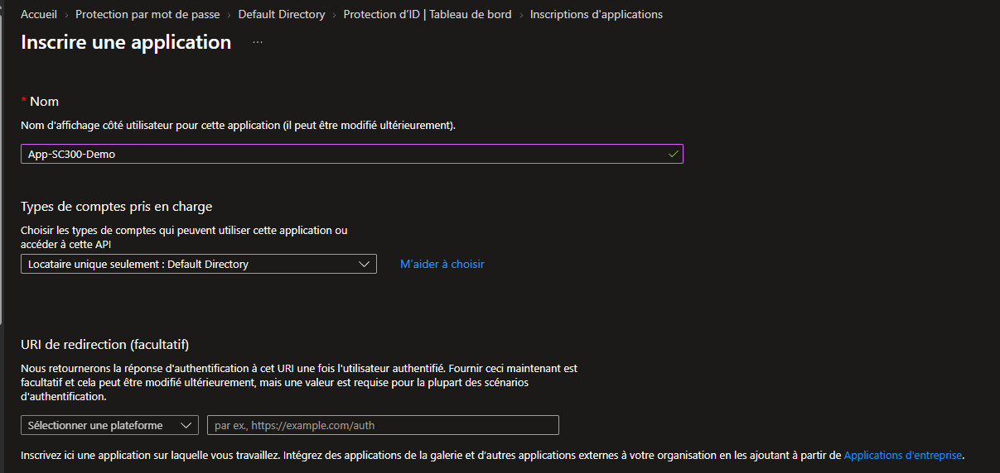
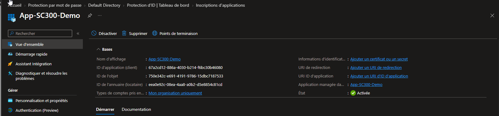
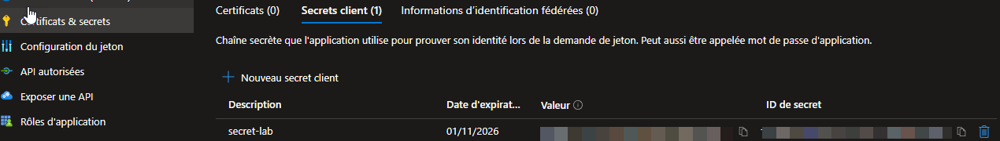

# SC-300-19 — Inscription d'une application (App Registration)

## Classification

| Champ | Valeur |
|-------|--------|
| **Code scénario** | SC-300-19 |
| **Nom** | Inscription d'une application et gestion de ses informations d'identification |
| **Type** | 🛡️ Défensif — Gestion des identités applicatives (Entra ID) |
| **Environnement** | Tenant Microsoft Entra `nchouarhipm.onmicrosoft.com` |
| **Domaine SC-300** | D3 (Access management for apps) |
| **Module Entra** | App registrations · Certificates & secrets |
| **Criticité opérationnelle** | 🟠 Élevée (identités applicatives / secrets) |
| **Contrôles ISO 27001** | A.5.16 (Gestion des identités), A.5.17 (Informations d'authentification), A.8.2 |
| **Exigences NIS2** | Art. 21.2(i) — contrôle d'accès |
| **MITRE D3FEND** | D3-CH (Credential Hardening) |
| **Réf. lab SC-300** | `Lab_19_RegisterAnApplication` |
| **Date** | Août 2026 |
| **Auteur** | hik3nR00t |

---

## Contexte & scénario

> **MediaTech Groupe SA** développe une application interne qui doit s'authentifier auprès de Microsoft Entra pour appeler des API (Microsoft Graph). L'app a besoin d'une **identité** dans l'annuaire (app registration) et d'un **moyen de s'authentifier** (secret ou certificat). Ce write-up crée cette identité applicative et gère ses informations d'identification selon les bonnes pratiques (secret à durée courte, préférence pour le certificat).

---

## Résumé exécutif

### Pour un recruteur

Ce write-up inscrit une application dans Microsoft Entra (**app registration**) en mono-locataire, relève ses identifiants (Application ID, Tenant ID, Object ID), puis crée un **secret client** avec expiration bornée. Il illustre la gestion des identités applicatives OAuth 2.0 / OIDC.

### Pour un auditeur ISO 27001 / NIS2

L'app registration crée une identité applicative tracée (A.5.16). Le **secret client** est une information d'authentification sensible (A.5.17) : il est à durée d'expiration courte, à stocker en coffre, et à faire tourner. La bonne pratique **certificat > secret** est documentée. Chaque création est journalisée.

### Pour un RSSI

Une app registration mal gérée = risque : un **secret qui fuit** permet à un attaquant d'usurper l'application et ses permissions. Points de contrôle — expiration courte des secrets, rotation, préférence certificat, inventaire des app registrations et de leurs secrets/permissions, alerte sur secrets expirants.

---

## Objectif & périmètre

Inscrire une application mono-locataire, relever ses identifiants, et créer un secret client borné. **Hors périmètre** : permissions d'API (cf. SC-300-21), configuration SSO (cf. SC-300-20).

---

## Prérequis

- Rôle **Global Administrator** / **Application Administrator** / **Application Developer**.

---

## Procédure de mise en œuvre

> Session **breakglass01** (GA).

1. `Identité → Applications → Inscriptions d'applications → + Nouvelle inscription`.
2. Nom `App-SC300-Demo` · Types de comptes = **Ce répertoire d'organisation uniquement (mono-locataire)** · URI de redirection = (laissé vide) → **S'inscrire**.
   
3. Vue d'ensemble → relever **ID d'application (client)**, **ID de locataire**, **ID d'objet**.
   
4. `Certificats et secrets → + Nouveau secret client` → description `secret-lab` · expiration bornée → **Ajouter** → copier la **Valeur** (visible une seule fois).
   

> ⚠️ La **Valeur** du secret est masquée dans la capture (jamais commitée en clair).

---

## Vérification & preuves d'audit

```
☐ App inscrite (mono-locataire), Application ID / Tenant ID relevés   → 01, 02
☐ Secret client créé avec expiration                                  → 03
☐ Valeur du secret masquée / stockée hors dépôt
☐ Audit logs → "Add application" / "Add service principal credentials"
```

---

## Impact métier — MediaTech Groupe SA

### Synthèse narrative

MediaTech dote son application d'une identité propre et d'un secret d'authentification — mais un secret est une clé : sa fuite = usurpation de l'app. D'où la rigueur (expiration courte, coffre, rotation, préférence certificat).

### Estimation financière (évitement de risque)

| Poste | Sans gestion | Avec gestion |
|-------|--------------|--------------|
| Secret d'app qui fuit (en clair, sans expiration) | usurpation de l'app + ses permissions | secret borné, révocable, tournant |
| Secrets expirés non renouvelés | panne applicative | alerte expiration |

### Impact réglementaire

RGPD Art. 32, ISO 27001 A.5.17, NIS2 Art. 21.2(i).

### Top actions

- **0–24 h** : stocker le secret au coffre (jamais en clair / dépôt).
- **1 semaine** : privilégier **certificat** plutôt que secret pour les apps sensibles.
- **1 mois** : inventaire des app registrations + alerte secrets expirants (< 30 j).

### Décisions COMEX

- Politique **certificat > secret** pour les applications de production.
- Inventaire et **rotation** des informations d'identification applicatives.

---

## Détection SOC / SIEM

| Source | Événement | Intérêt |
|--------|-----------|---------|
| Audit logs | `Add application` | Nouvelle app registration |
| Audit logs | `Add service principal credentials` | Ajout de secret/certificat |
| Audit logs | Ajout de secret sur app privilégiée | **À alerter** |

```kusto
AuditLogs
| where OperationName in ("Add application","Update application - Certificates and secrets management")
| extend Initiator = tostring(InitiatedBy.user.userPrincipalName)
| project TimeGenerated, OperationName, Initiator, TargetResources
| order by TimeGenerated desc
```

---

## Durcissement continu — `m365-admin-toolkit`

| Contrôle | Script toolkit |
|----------|----------------|
| Inventaire des app registrations & service principals | `audit-tenant-config` |
| Secrets/certs proches de l'expiration | `audit-security-policies` |
| Apps avec secrets (vs certificats) | `audit-security-policies` |

- **0–24 h** : secret au coffre.
- **1 mois** : rapport secrets expirants + bascule certificat.

---

## Points d'examen SC-300

- **App registration** ≠ **Enterprise application** : l'inscription crée l'objet application ; l'enterprise app est le **service principal** (instance locale).
- **Application ID (client)** = identifiant global de l'app ; **Object ID** = identifiant de l'objet dans CE tenant.
- **Secret vs certificat** : le certificat est plus sûr (pas de secret partagé) — recommandé en prod.
- Un secret est visible **une seule fois** à la création.

---

## Références

- [SC-300 Study Guide](https://learn.microsoft.com/en-us/credentials/certifications/resources/study-guides/sc-300)
- [Lab_19 Register an Application](https://microsoftlearning.github.io/SC-300-Identity-and-Access-Administrator/Instructions/Labs/Lab_19_RegisterAnApplication.html)
- [m365-admin-toolkit](https://github.com/hikenroot/m365-admin-toolkit)
