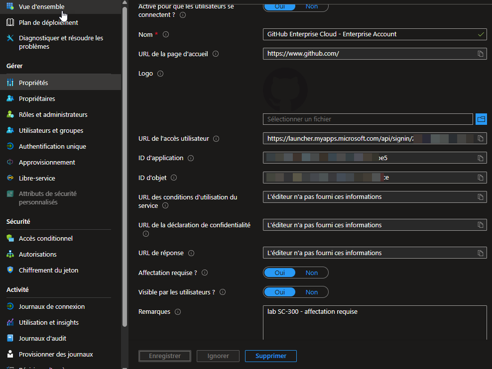
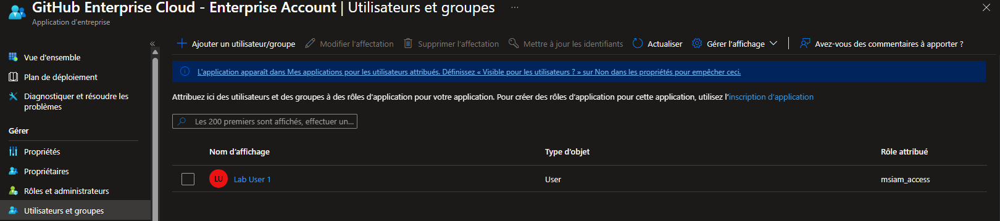

# SC-300-20 — Gestion des accès aux applications

## Classification

| Champ | Valeur |
|-------|--------|
| **Code scénario** | SC-300-20 |
| **Nom** | Restriction des accès à une application d'entreprise (affectation requise) |
| **Type** | 🛡️ Défensif — Gestion des accès applicatifs (Entra ID) |
| **Environnement** | Tenant Microsoft Entra `nchouarhipm.onmicrosoft.com` |
| **Domaine SC-300** | D3 (Access management for apps) |
| **Module Entra** | Enterprise applications · Users and groups · Properties |
| **Criticité opérationnelle** | 🟠 Élevée (accès applicatifs) |
| **Contrôles ISO 27001** | A.5.15 (Contrôle d'accès), A.5.18 (Droits d'accès) |
| **Exigences NIS2** | Art. 21.2(i) — contrôle d'accès |
| **MITRE D3FEND** | D3-UAP (User Account Permissions) |
| **Réf. lab SC-300** | `Lab_20_ImplementAccessManagementForApps` |
| **Date** | Août 2026 |
| **Auteur** | hik3nR00t |

---

## Contexte & scénario

> **MediaTech Groupe SA** intègre une application SaaS (GitHub Enterprise) à son tenant. Par défaut, **tous** les utilisateurs du tenant pourraient y accéder. On applique le **moindre privilège applicatif** : seuls les utilisateurs explicitement assignés accèdent à l'application.

---

## Résumé exécutif

### Pour un recruteur

Ce write-up ajoute une application d'entreprise depuis la galerie, active **« Affectation requise »**, puis assigne un utilisateur spécifique. Résultat : l'accès à l'app est restreint aux seuls utilisateurs assignés (moindre privilège applicatif).

### Pour un auditeur ISO 27001 / NIS2

Le paramètre **« Affectation requise = Oui »** applique le principe du besoin d'en connaître (A.5.15/A.5.18) : l'accès à l'application est explicitement accordé, non implicite. Les affectations sont tracées et reviewables. Combiné à l'accès conditionnel, cela cadre l'accès aux ressources SaaS.

### Pour un RSSI

Sans « Affectation requise », **tout le tenant** accède à l'app dès qu'elle est intégrée — surface d'accès non maîtrisée. En l'activant, on réduit l'exposition aux seuls utilisateurs métier concernés. Combiner avec l'accès conditionnel (MFA, device compliance) pour un accès applicatif durci.

---

## Objectif & périmètre

Intégrer une application d'entreprise, activer l'affectation requise, et assigner un utilisateur. **Hors périmètre** : configuration SSO SAML, provisioning automatique.

---

## Prérequis

- Rôle **Global Administrator** / **Application Administrator** / **Cloud Application Administrator**.

---

## Procédure de mise en œuvre

> Session **breakglass01** (GA).

1. `Identité → Applications → Applications d'entreprise → + Nouvelle application` → app de galerie (**GitHub Enterprise Cloud**) → **Créer**.
2. `Propriétés` → **« Affectation requise ? » = Oui** → remarque `lab SC-300 - affectation requise` → **Enregistrer**.
   
3. `Utilisateurs et groupes → + Ajouter un utilisateur/groupe` → **Lab User 1** → **Attribuer**.
   

> Rôle attribué par défaut : `msiam_access` (accès applicatif de base).

---

## Vérification & preuves d'audit

```
☐ Application d'entreprise créée (galerie)
☐ « Affectation requise ? » = Oui                              → 02
☐ Lab User 1 assigné                                           → 03
☐ Audit logs → "Add app role assignment to user" / "Update application"
```

---

## Impact métier — MediaTech Groupe SA

### Synthèse narrative

MediaTech intègre GitHub sans l'ouvrir à tout le monde : seuls les développeurs assignés y accèdent. L'accès applicatif suit le besoin métier, pas un défaut permissif.

### Estimation financière

| Poste | Sans affectation requise | Avec affectation requise |
|-------|--------------------------|---------------------------|
| Accès applicatif | tout le tenant (surface large) | users assignés uniquement |
| Licences SaaS consommées | risque de sur-consommation | maîtrisée par assignation |

### Impact réglementaire

RGPD Art. 32, ISO 27001 A.5.15/A.5.18, NIS2 Art. 21.2(i).

### Top actions

- **0–24 h** : « Affectation requise = Oui » sur les apps sensibles.
- **1 semaine** : coupler à l'accès conditionnel (MFA + device).
- **1 mois** : Access Reviews sur les assignations d'apps.

### Décisions COMEX

- Politique **« affectation requise »** par défaut pour les apps métier.

---

## Détection SOC / SIEM

| Source | Événement | Intérêt |
|--------|-----------|---------|
| Audit logs | `Add app role assignment to user` | Nouvel accès applicatif |
| Sign-in logs | Connexions à l'application | Suivi des accès |
| Audit logs | Désactivation « affectation requise » | **À alerter** (ouverture) |

```kusto
AuditLogs
| where OperationName == "Add app role assignment to user"
| extend App = tostring(TargetResources[0].displayName)
| project TimeGenerated, App, TargetResources
| order by TimeGenerated desc
```

---

## Durcissement continu — `m365-admin-toolkit`

| Contrôle | Script toolkit |
|----------|----------------|
| Apps sans « affectation requise » | `audit-security-policies` |
| Inventaire des assignations d'apps | `audit-tenant-config` |

- **0–24 h** : activer « affectation requise » sur les apps critiques.
- **1 mois** : Access Reviews + accès conditionnel par app.

---

## Points d'examen SC-300

- **« Affectation requise = Oui »** → seuls les utilisateurs/groupes assignés accèdent à l'app (sinon tout le tenant).
- **« Visible par les utilisateurs = Non »** → cache l'app de « Mes applications » (ne restreint pas l'accès, juste la visibilité).
- L'assignation peut se faire par **utilisateur** ou par **groupe** (préférer les groupes en prod).
- Combiner avec **Conditional Access** pour un accès applicatif conditionné (MFA, device).

---

## Références

- [SC-300 Study Guide](https://learn.microsoft.com/en-us/credentials/certifications/resources/study-guides/sc-300)
- [Lab_20 Implement Access Management for Apps](https://microsoftlearning.github.io/SC-300-Identity-and-Access-Administrator/Instructions/Labs/Lab_20_ImplementAccessManagementForApps.html)
- [m365-admin-toolkit](https://github.com/hikenroot/m365-admin-toolkit)
