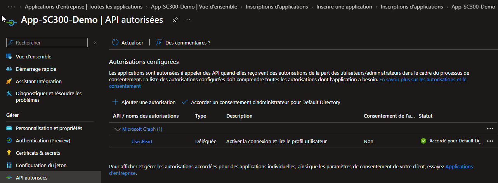
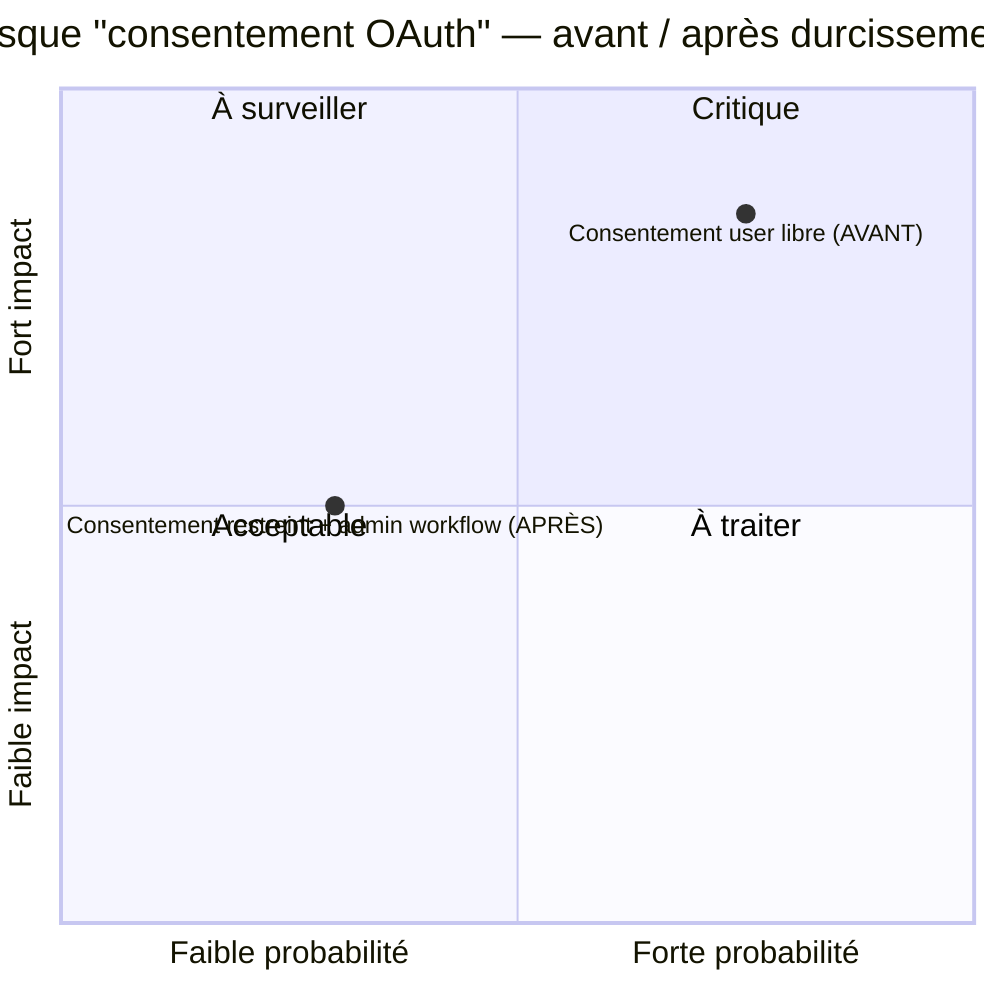

# SC-300-21 — Consentement d'administrateur à l'échelle du tenant

## Classification

| Champ | Valeur |
|-------|--------|
| **Code scénario** | SC-300-21 |
| **Nom** | Octroi d'un consentement d'administrateur à une application (tenant-wide) |
| **Type** | 🛡️ Défensif — Gouvernance du consentement OAuth (Entra ID) |
| **Environnement** | Tenant Microsoft Entra `nchouarhipm.onmicrosoft.com` |
| **Domaine SC-300** | D3 (Access management for apps) |
| **Module Entra** | App registrations · API permissions · Admin consent |
| **Criticité opérationnelle** | 🔴 Critique (consentement OAuth tenant-wide) |
| **Contrôles ISO 27001** | A.5.15 (Contrôle d'accès), A.5.18, A.8.2 (Accès privilégiés) |
| **Exigences NIS2** | Art. 21.2(i) — contrôle d'accès |
| **MITRE D3FEND** | D3-UAP · **Contre** T1528 (Steal Application Access Token) / consent phishing |
| **Réf. lab SC-300** | `Lab_21_GrantTenantWideAdminConsent` |
| **Date** | Août 2026 |
| **Auteur** | hik3nR00t |

---

## Contexte & scénario

> Une application de **MediaTech Groupe SA** a besoin d'une permission Microsoft Graph pour fonctionner. Plutôt que de laisser chaque utilisateur consentir individuellement (friction + risque), l'administrateur **accorde le consentement pour tout le tenant** en une fois. C'est puissant — et c'est exactement le mécanisme détourné par les attaques de **consent phishing** : d'où la nécessité de le maîtriser.

---

## Résumé exécutif

### Pour un recruteur

Ce write-up ajoute une permission d'API (Microsoft Graph — `User.Read`) à une application, puis accorde le **consentement d'administrateur à l'échelle du tenant** : la permission est validée une fois pour tous les utilisateurs, sans consentement individuel.

### Pour un auditeur ISO 27001 / NIS2

Le consentement admin tenant-wide est un **acte privilégié** (A.8.2) qui doit être maîtrisé : il accorde des permissions à une application pour l'ensemble des utilisateurs. Il doit être réservé aux administrateurs, journalisé, et encadré par une **politique de consentement utilisateur restrictive** (les utilisateurs ne consentent pas librement aux apps).

### Pour un RSSI

Le consentement OAuth est le vecteur du **consent phishing** (T1528) : un attaquant crée une app malveillante et pousse les utilisateurs à lui consentir des permissions. Contre-mesures — restreindre le **consentement utilisateur** (les users ne peuvent pas consentir seuls aux apps à permissions sensibles), exiger le **workflow de demande d'admin consent**, et auditer les consentements accordés. Accorder un admin consent est légitime mais doit être délibéré et tracé.

---

## Objectif & périmètre

Ajouter une permission d'API et accorder le consentement d'administrateur tenant-wide. **Hors périmètre** : configuration de la politique de consentement utilisateur (durcissement recommandé — voir §Durcissement).

---

## Prérequis

- Rôle **Global Administrator** / **Privileged Role Administrator** / **Cloud Application Administrator** (pour accorder l'admin consent).

---

## Procédure de mise en œuvre

> Session **breakglass01** (GA).

1. `Inscriptions d'applications → App-SC300-Demo → Autorisations d'API`.
2. Permission présente : **Microsoft Graph → `User.Read`** (déléguée), Statut = **Non** consenti.
3. Cliquer **« Accorder un consentement d'administrateur pour Default Directory »** → confirmer **Oui**.
   
4. Le statut passe à ✅ **« Accordé pour Default Directory »**.

> Pour ajouter une permission plus sensible : `+ Ajouter une autorisation → Microsoft Graph → Autorisations d'application` (ex. `User.Read.All`) — celles-ci **exigent** un admin consent.

---

## Vérification & preuves d'audit

```
☐ Permission Graph présente                                    → 01
☐ Statut = "Accordé pour Default Directory" (vert)             → 01
☐ Audit logs → "Consent to application" / "Add delegated permission grant"
☐ Enterprise app → Autorisations → consentement visible
```

---

## Impact métier — MediaTech Groupe SA

### Synthèse narrative

MediaTech valide en une fois les permissions d'une app légitime, évitant la friction du consentement individuel. Mais ce même mécanisme, mal gouverné, ouvre la porte au consent phishing — d'où le durcissement de la politique de consentement utilisateur en parallèle.

### Estimation financière (évitement de risque)

| Poste | Consentement non maîtrisé | Consentement gouverné |
|-------|----------------------------|------------------------|
| Consent phishing (app malveillante) | exfiltration de données via OAuth | users ne peuvent pas consentir seuls |
| Friction (consentement individuel) | ralentit l'adoption des apps légitimes | admin consent une fois |

### Matrice de risque



### Impact réglementaire

RGPD Art. 32 (accès aux données), ISO 27001 A.8.2, NIS2 Art. 21.2(i).

### Top actions

- **0–24 h** : restreindre le **consentement utilisateur** (`Users can consent to apps = No` ou limité aux permissions à faible risque).
- **1 semaine** : activer le **workflow de demande de consentement admin**.
- **1 mois** : audit régulier des consentements OAuth accordés (apps + permissions).

### Décisions COMEX

- Interdire le **consentement utilisateur libre** ; centraliser via workflow admin.
- Mandater un **audit trimestriel des permissions OAuth**.

---

## Détection SOC / SIEM

| Source | Événement | Intérêt |
|--------|-----------|---------|
| Audit logs | `Consent to application` | Consentement accordé |
| Audit logs | `Add app role assignment grant to user` | Permission d'application |
| Audit logs | Consentement à app inconnue/permissions élevées | **Consent phishing potentiel** |

```kusto
AuditLogs
| where OperationName in ("Consent to application","Add delegated permission grant")
| extend App = tostring(TargetResources[0].displayName), Initiator = tostring(InitiatedBy.user.userPrincipalName)
| project TimeGenerated, OperationName, App, Initiator
| order by TimeGenerated desc
```
> Consentement à une app inconnue avec permissions type `Mail.Read`, `Files.ReadWrite.All` = **signal fort de consent phishing**.

---

## Durcissement continu — `m365-admin-toolkit`

| Contrôle | Script toolkit |
|----------|----------------|
| Politique de consentement utilisateur (restreinte ?) | `audit-security-policies` |
| Inventaire des consentements OAuth accordés | `audit-tenant-config` |
| Apps avec permissions à haut risque | `audit-security-policies` |

- **0–24 h** : `Users can consent = No` (ou permissions à faible risque uniquement).
- **1 mois** : audit OAuth + workflow admin consent.

---

## Points d'examen SC-300

- **Admin consent tenant-wide** = valide une permission pour **tous** les utilisateurs, une seule fois.
- **Permissions déléguées** (agit au nom de l'utilisateur) vs **permissions d'application** (agit sans utilisateur — exigent toujours admin consent).
- Restreindre le **user consent** est la contre-mesure clé du **consent phishing**.
- Le **workflow de demande de consentement admin** permet aux users de demander sans consentir eux-mêmes.

---

## Références

- [SC-300 Study Guide](https://learn.microsoft.com/en-us/credentials/certifications/resources/study-guides/sc-300)
- [Lab_21 Grant Tenant-Wide Admin Consent](https://microsoftlearning.github.io/SC-300-Identity-and-Access-Administrator/Instructions/Labs/Lab_21_GrantTenantWideAdminConsent.html)
- [m365-admin-toolkit](https://github.com/hikenroot/m365-admin-toolkit)
