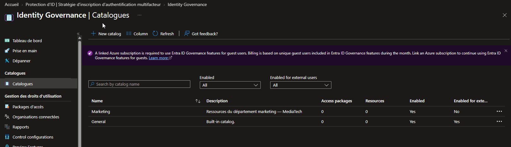
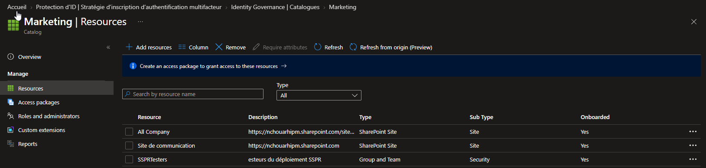
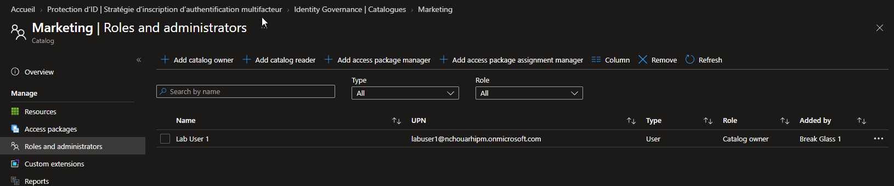

# SC-300-22 — Create and Manage a Catalog in Entitlement Management

## 1. Classification

| Champ | Valeur |
|-------|--------|
| **Code** | SC-300-22 |
| **Type** | Lab de mise en œuvre — Gouvernance des identités (Entitlement Management) |
| **Domaine SC-300** | D4 — Gérer la gouvernance des identités (20-25%) |
| **Lab officiel** | `Lab_22_CreateAndManageACatalogOfResourcesInAADEntitlementManagement.md` (MicrosoftLearning/SC-300) |
| **ISO 27001:2022** | A.5.15 (Contrôle d'accès), A.5.18 (Droits d'accès), A.8.2 (Accès privilégiés) |
| **NIS2** | Art. 21.2(i) — politiques de contrôle d'accès et gouvernance |
| **MITRE D3FEND** | D3-UAP (User Account Permissions), D3-ACH (Access Control Hardening) |
| **MITRE ATT&CK (contré)** | T1078 (Valid Accounts) — via accès gouverné, borné et révocable |
| **Tenant** | `nchouarhipm.onmicrosoft.com` · Entra ID **P2** / Entra ID Governance |
| **Auteur** | hik3nR00t |
| **Date** | 04/08/2026 |

---

## 2. Contexte & scénario — MediaTech Groupe SA

> *MediaTech Groupe SA veut sortir de la gestion d'accès « au ticket » : chaque demande d'accès (groupe, app, site SharePoint) passe par le helpdesk, sans approbation formalisée ni expiration. Le RSSI veut un catalogue de ressources par département, géré par des propriétaires métier (pas la DSI), servant de base à des demandes d'accès en self-service avec approbation et durée limitée. Première brique : le catalogue « Marketing ».*

Ce lab crée un **catalogue Entitlement Management** regroupant les ressources d'un département, avec délégation de la gestion à un propriétaire non-admin.

---

## 3. Résumé exécutif

### Pour un recruteur
Mise en place de la gouvernance des accès via Microsoft Entra Entitlement Management : création d'un catalogue de ressources (groupes, applications, sites SharePoint), fondation des *access packages* qui permettent aux utilisateurs de demander un accès en self-service, avec approbation et expiration automatiques. La gestion est déléguée à un propriétaire métier selon le principe du moindre privilège.

### Pour un auditeur ISO 27001 / NIS2
- **A.5.15 / A.5.18** : les droits d'accès sont gouvernés (demande → approbation → durée → revue → révocation), pas attribués de façon ad hoc.
- **A.8.2** : délégation via rôles de catalogue (Owner, Reader, Access package manager) — le propriétaire métier gère sans être Global Admin.
- **Séparation des responsabilités** : la DSI cadre, le métier gère son catalogue.
- **Traçabilité** : chaque catalogue, ressource et rôle est journalisé (créé par breakglass01, propriétaire assigné).

### Pour un RSSI
Le catalogue est la brique de base d'un accès « juste ce qu'il faut, juste le temps qu'il faut » : au lieu d'accès permanents accordés au ticket, on construit des access packages demandables, approuvés et expirants. La délégation aux propriétaires métier décharge la DSI tout en gardant le contrôle (least privilege). Prérequis : P2/Entra ID Governance ; la gouvernance des invités nécessite un abonnement Azure lié (facturation à l'usage).

---

## 4. Objectif & périmètre

Créer un **catalogue** (`Marketing`), y ajouter des **ressources** hétérogènes (groupe + sites SharePoint), et **déléguer** sa gestion à un propriétaire non-admin.

**Hors périmètre** : création d'access packages + politiques (self-service request), organisations connectées, access reviews du catalogue (couvert au SC-300-25).

---

## 5. Prérequis

- Licence **Entra ID P2** ou **Entra ID Governance**.
- Session **breakglass01** (Global Administrator).
- Ressources cibles existantes : groupe `SSPRTesters`, sites SharePoint (`All Company`, `Site de communication`).
- ⚠️ La gouvernance des **utilisateurs invités** nécessite un **abonnement Azure lié** (facturation à l'usage — bandeau d'avertissement dans la blade).

---

## 6. Procédure de mise en œuvre

> Session **breakglass01** · `entra.microsoft.com` · labels EN (blade Governance partiellement en anglais).

### 6.1 — Créer le catalogue

`Identity Governance → Entitlement management → Catalogs → + New catalog`
- Nom : `Marketing`
- Description : `Ressources du département marketing — MediaTech`
- **Enabled** : Yes · **Enabled for external users** : No
- Create.



### 6.2 — Ajouter des ressources

`Marketing → Resources → + Add resources` → onglets Groups and Teams / Applications / SharePoint sites.
Ajout de **3 ressources** :
- **Groups and Teams** : `SSPRTesters` (Security)
- **SharePoint sites** : `All Company`, `Site de communication`

→ Toutes **Onboarded = Yes**.



### 6.3 — Déléguer la propriété

`Marketing → Roles and administrators → + Add catalog owner` → **Lab User 1** → Select.

→ `Lab User 1 = Catalog owner` (ajouté par Break Glass 1). Rôles de délégation disponibles : **Catalog owner**, **Catalog reader**, **Access package manager**, **Access package assignment manager**.



---

## 7. Vérification & preuves d'audit

### Checklist

```
☐ Catalogue Marketing = Enabled Yes, external users No
☐ 3 ressources onboardées (1 groupe + 2 sites SharePoint)
☐ Lab User 1 = Catalog owner (délégation non-admin)
☐ Créé par breakglass01 (traçabilité)
```

### Vérification Graph PowerShell (pwsh)

```powershell
Connect-MgGraph -Scopes "EntitlementManagement.Read.All"

# 1. Le catalogue et son état
Get-MgEntitlementManagementCatalog -Filter "displayName eq 'Marketing'" |
  Select-Object DisplayName, State, IsExternallyVisible, Id

# 2. Ressources du catalogue
$cat = Get-MgEntitlementManagementCatalog -Filter "displayName eq 'Marketing'"
Get-MgEntitlementManagementCatalogResource -AccessPackageCatalogId $cat.Id |
  Select-Object DisplayName, @{n='Type';e={$_.OriginSystem}}

# 3. Rôles portés par les ressources du catalogue (member/owner de groupe, rôles d'app…)
Get-MgEntitlementManagementCatalogResourceRole -AccessPackageCatalogId $cat.Id |
  Select-Object DisplayName, OriginSystem

# 4. Propriétaires/administrateurs du catalogue (attributions RBAC Entitlement Management) :
#    exposés via roleManagement/entitlementManagement/roleAssignments filtré sur le catalogue,
#    pas via un cmdlet dédié simple — vérification pratique dans le portail
#    (Catalog → Roles and administrators). La preuve visuelle sert de contrôle ici.
```

Attendu : `State = published`, `IsExternallyVisible = false`, 3 ressources, propriétaire délégué (visible portail).

---

## 8. Impact métier — MediaTech Groupe SA

### Synthèse narrative
Le catalogue déplace la gestion d'accès du ticket vers un modèle gouverné et délégué : le métier gère ses ressources, les utilisateurs demandent en self-service, l'accès est approuvé et expire. Pour MediaTech, c'est moins de tickets, moins d'accès permanents oubliés, et une piste d'audit exploitable.

### Estimation financière (valeur / risque évité)

| Poste | Estimation annuelle | Justification |
|---|---|---|
| Réduction tickets d'accès | 50 000 € – 150 000 € | Self-service gouverné vs helpdesk |
| Risque d'accès permanent orphelin évité | 100 000 € – 600 000 € | Accès expirants + revues → moins de sur-privilèges |
| Conformité auditée (droits d'accès) | 30 000 € – 120 000 € | Piste d'audit prête pour ISO/NIS2 |
| **Total valeur** | **180 000 € – 870 000 €** | Requiert P2/Governance (à cadrer) |

### Impact réglementaire
- **ISO 27001 A.5.15 / A.5.18** : provisionnement et revue des droits d'accès formalisés.
- **NIS2 Art. 21.2(i)** : politiques de contrôle d'accès opérationnalisées.
- **RGPD** : minimisation des accès aux données (accès bornés).

### Top actions prioritaires
**0–24h** : (1) définir les catalogues par département/projet ; (2) nommer les propriétaires métier.
**1 semaine** : (3) construire les premiers **access packages** (self-service + approbation + expiration) ; (4) cadrer les politiques d'approbation.
**1 mois** : (5) généraliser à tous les départements ; (6) ajouter des **access reviews** récurrentes (SC-300-25) ; (7) lier un abonnement Azure pour la gouvernance des invités.

### Décisions attendues du COMEX
- Valider le **modèle de gouvernance des accès** (catalogues + propriétaires métier).
- Financer **Entra ID Governance** / l'abonnement Azure pour les invités.
- Arbitrer les **workflows d'approbation** (qui approuve quoi).

---

## 9. Détection SOC / SIEM

### Signaux clés

| Source | Signal | Usage |
|---|---|---|
| `AuditLogs` (loggedByService = Entitlement Management) | Create/Update catalog | Gestion du catalogue |
| `AuditLogs` | Add/Remove catalog resource | Modification des ressources gouvernées |
| `AuditLogs` | Add catalog owner/role | Changement de délégation (à surveiller) |
| `AuditLogs` | Access package assignment | Attribution d'accès effective |

### Requêtes KQL

```kql
// 1. Activité de gestion des catalogues
AuditLogs
| where LoggedByService contains "Entitlement"
| where ActivityDisplayName has_any ("catalog","resource","owner")
| project TimeGenerated, ActivityDisplayName,
          Actor = tostring(InitiatedBy.user.userPrincipalName),
          Target = tostring(TargetResources[0].displayName)
| sort by TimeGenerated desc
```

```kql
// 2. Ajout de propriétaires/rôles de catalogue (élévation de délégation)
AuditLogs
| where LoggedByService contains "Entitlement"
| where ActivityDisplayName has_any ("Add catalog owner","Add access package manager")
| project TimeGenerated, ActivityDisplayName,
          Actor = tostring(InitiatedBy.user.userPrincipalName),
          Grantee = tostring(TargetResources[0].userPrincipalName)
```

```kql
// 3. Attributions d'access packages (accès effectifs accordés)
AuditLogs
| where LoggedByService contains "Entitlement"
| where ActivityDisplayName has "assignment"
| summarize count() by ActivityDisplayName, bin(TimeGenerated, 1d)
```

---

## 10. Pièges rencontrés (terrain)

- **Abonnement Azure requis pour les invités** : bandeau *« A linked Azure subscription is required to use Entra ID Governance features for guest users »* — la gouvernance des invités est facturée à l'usage. Impact direct sur le SC-300-24.
- **Catalogue « General » built-in** : un catalogue par défaut existe déjà (Enabled, externes = Yes) — ne pas le confondre avec le catalogue métier créé.
- **Ressources « Onboarded »** : une ressource ajoutée doit passer `Onboarded = Yes` avant d'être utilisable dans un access package.
- **Delegation ≠ Global Admin** : le propriétaire de catalogue gère ressources et access packages sans droit d'annuaire élevé — c'est le but (least privilege).
- **Blade partiellement en anglais** même sur tenant FR (Identity Governance).

---

## 11. Durcissement continu

- Structurer les catalogues par **périmètre métier** (un propriétaire responsable par catalogue).
- Systématiser **approbation + expiration** sur chaque access package (pas d'accès permanent).
- Coupler chaque catalogue à des **access reviews** récurrentes (SC-300-25).
- Surveiller les **ajouts de propriétaires/managers** (élévation de délégation).
- Restreindre `Enabled for external users` aux catalogues réellement destinés aux invités, et lier l'abonnement Azure requis.

> Cross-ref audit PowerShell : [`m365-admin-toolkit`](https://github.com/hikenroot/m365-admin-toolkit) — inventaire des catalogues, ressources et délégations Entitlement Management. Cross-ref : [`ad-hardening-baseline`](https://github.com/hikenroot/ad-hardening-baseline).

---

## 12. Points d'examen SC-300

- **Entitlement Management** : Catalogues → Ressources → **Access packages** → Politiques (self-service request + approbation + expiration).
- Un **catalogue** = conteneur de ressources (Groups & Teams, Applications, SharePoint sites, Azure resources, rôles Entra).
- Rôles de délégation : **Catalog owner**, **Catalog reader**, **Access package manager**, **Access package assignment manager**.
- **P2 / Entra ID Governance** requis. Gouvernance des **invités** = abonnement Azure lié (facturation).
- `Enabled for external users` contrôle la visibilité aux invités.
- Le propriétaire de catalogue gère **sans être Global Admin** (least privilege / délégation).
- Une ressource doit être **onboardée** avant usage dans un access package.

---

## 13. Références

- Study Guide SC-300 — « Plan and implement entitlement management ».
- Lab officiel : `Lab_22_CreateAndManageACatalogOfResourcesInAADEntitlementManagement` — MicrosoftLearning/SC-300 · [github.io](https://microsoftlearning.github.io/SC-300-Identity-and-Access-Administrator/Instructions/Labs/Lab_22_CreateAndManageACatalogOfResourcesInAADEntitlementManagement.html)
- Docs : Entitlement management — catalogs · access packages · delegation roles.
- Toolkits : [`m365-admin-toolkit`](https://github.com/hikenroot/m365-admin-toolkit) · [`ad-hardening-baseline`](https://github.com/hikenroot/ad-hardening-baseline)

---

*Write-up HikenRoot Forge — SC-300-22 — hik3nR00t — 04/08/2026*
