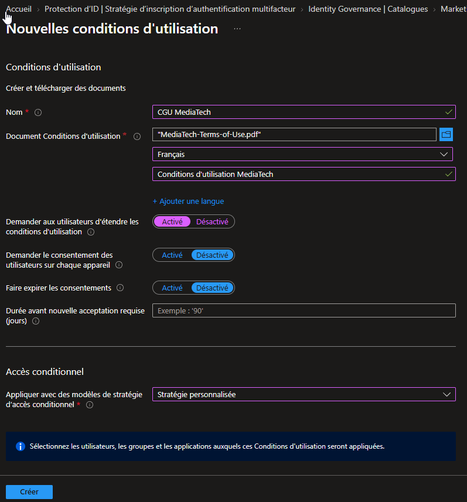
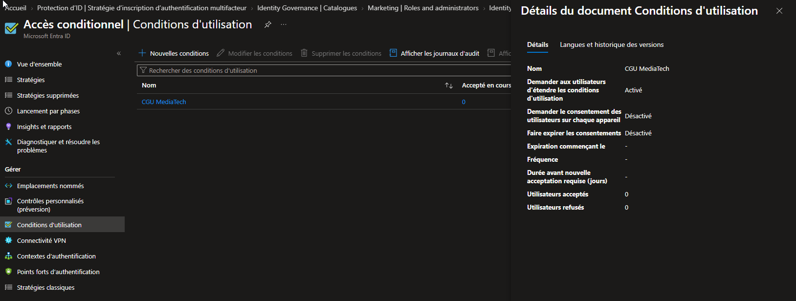
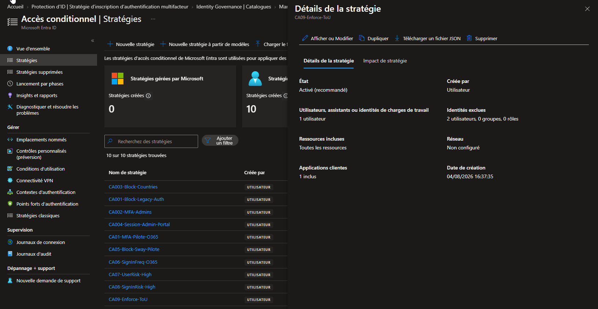
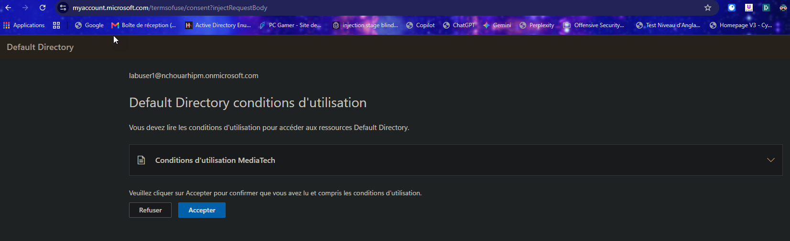
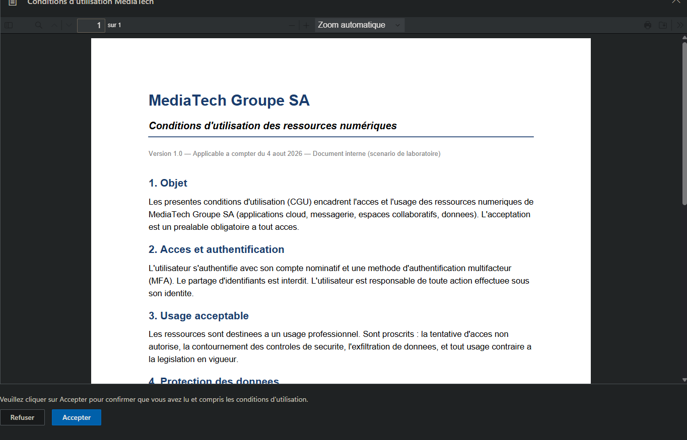
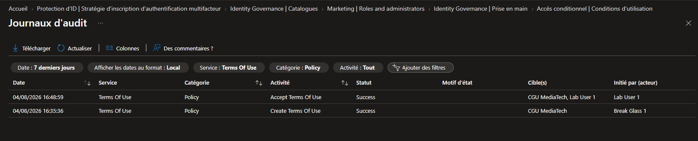

# SC-300-23 — Add Terms of Use and Acceptance Reporting

## 1. Classification

| Champ | Valeur |
|-------|--------|
| **Code** | SC-300-23 |
| **Type** | Lab de mise en œuvre — Conditions d'utilisation (ToU) + reporting |
| **Domaine SC-300** | D4 — Gérer la gouvernance des identités (20-25%) |
| **Lab officiel** | `Lab_23_AddTermsOfUseAcceptanceReporting.md` (MicrosoftLearning/SC-300) |
| **ISO 27001:2022** | A.5.15 (Contrôle d'accès), A.5.31 (Exigences légales), A.6.2 (Conditions d'emploi) |
| **NIS2** | Art. 21.2(i) — politiques de contrôle d'accès et responsabilisation des utilisateurs |
| **MITRE D3FEND** | D3-ACH (Access Control Hardening) |
| **RGPD** | Art. 7 (preuve du consentement) — enregistrement daté de l'acceptation |
| **Tenant** | `nchouarhipm.onmicrosoft.com` · Entra ID P1+ |
| **Auteur** | hik3nR00t |
| **Date** | 04/08/2026 |

---

## 2. Contexte & scénario — MediaTech Groupe SA

> *MediaTech Groupe SA doit, pour des raisons légales et de conformité (ISO 27001, NIS2, RGPD), garantir que chaque collaborateur a lu et accepté les conditions d'utilisation des ressources numériques avant d'y accéder — avec une preuve horodatée exploitable en audit. Le RSSI veut que cette acceptation soit un préalable technique bloquant, pas une signature papier oubliée dans un classeur.*

Ce lab crée des **conditions d'utilisation (ToU)** imposées via **Conditional Access** : l'utilisateur doit dérouler le document et accepter pour accéder aux ressources ; l'acceptation est tracée.

---

## 3. Résumé exécutif

### Pour un recruteur
Mise en place de conditions d'utilisation légales dans Microsoft Entra, imposées comme contrôle d'accès conditionnel : l'utilisateur doit lire (déroulement forcé) et accepter le document avant tout accès. L'acceptation est horodatée, signée et exportable — transformant une obligation légale en contrôle technique bloquant et auditable.

### Pour un auditeur ISO 27001 / NIS2
- **A.5.31 (Exigences légales)** : les obligations légales/contractuelles sont présentées et acceptées avant accès.
- **A.6.2 (Conditions d'emploi)** : responsabilisation de l'utilisateur formalisée.
- **RGPD Art. 7** : preuve du consentement — chaque acceptation est journalisée (utilisateur, date, version du document).
- **Contrôle bloquant** : l'acceptation est un *grant control* CA — pas d'accès sans acceptation.
- **Traçabilité** : journal d'audit « Accept Terms Of Use / Success » signé par l'utilisateur.

### Pour un RSSI
Les ToU ferment le risque « l'utilisateur n'a jamais formellement accepté la politique ». C'est un contrôle technique, non contournable (imposé à l'authentification), avec preuve d'acceptation exploitable en cas d'incident ou de contentieux. La réacceptation périodique (expire consents) et le versionnage du document permettent de suivre les évolutions de politique.

---

## 4. Objectif & périmètre

Créer des **conditions d'utilisation** (PDF), les **imposer via CA** à un utilisateur cible (labuser1), forcer le **déroulement** du document, et **prouver l'acceptation** (reporting + audit).

**Hors périmètre** : expiration/réacceptation périodique (démontrée en théorie), consentement par appareil, ToU multi-langues (une seule langue ici), templates « tous les invités ».

---

## 5. Prérequis

- Licence **Entra ID P1+** (les ToU nécessitent au moins P1).
- Session **breakglass01** (Global Administrator).
- Un **document PDF** de conditions d'utilisation (généré : `MediaTech-Terms-of-Use.pdf`).
- Compte de test : labuser1 (mot de passe connu).

---

## 6. Procédure de mise en œuvre

> Session **breakglass01** · `entra.microsoft.com` · labels FR.

### 6.1 — Créer les conditions d'utilisation

`Entra ID → Protection → Accès conditionnel → Conditions d'utilisation → + Nouvelles conditions d'utilisation`
- **Nom** (interne) : `CGU MediaTech`
- **Document** : upload `MediaTech-Terms-of-Use.pdf`
- **Langue** : Français · **Nom d'affichage** : `Conditions d'utilisation MediaTech`
- **Exiger de développer les CGU** : **Activé** (force la lecture complète)
- **Consentement par appareil** : Désactivé · **Expirer les consentements** : Désactivé
- **Accès conditionnel** : **Stratégie personnalisée**
- **Créer**



Détails de la ToU créée (déroulement forcé = Activé) :



### 6.2 — Imposer via Conditional Access

`Accès conditionnel → + Nouvelle stratégie`
- Nom : `CA09-Enforce-ToU`
- Utilisateurs : Inclure **labuser1** · Exclure **breakglass01 + breakglass02**
- Ressources : **Toutes les ressources**
- Octroyer → **Accorder l'accès** → coche **Conditions d'utilisation MediaTech** (la ToU apparaît comme contrôle d'octroi)
- Activer : **Activé** → Créer.



### 6.3 — Test : présentation et acceptation

InPrivate → `portal.azure.com` → labuser1 (+ MFA) → page **« Conditions d'utilisation MediaTech »** → déroulement obligatoire du PDF → **Accepter**.





### 6.4 — Preuve d'acceptation (reporting + audit)

`Conditions d'utilisation → Afficher les journaux d'audit` (Service = Terms Of Use) :
- `Accept Terms Of Use` — **Success** — CGU MediaTech, **Lab User 1** — initié par Lab User 1.
- `Create Terms Of Use` — Success — Break Glass 1.



> Le compteur « Accepté » de la vue liste peut avoir un léger retard (cohérence différée) ; le **journal d'audit** est la preuve immédiate et horodatée.

---

## 7. Vérification & preuves d'audit

### Checklist

```
☐ ToU CGU MediaTech créée (déroulement forcé Activé)
☐ CA09-Enforce-ToU : Activé, contrôle = Conditions d'utilisation MediaTech
☐ breakglass01 + breakglass02 exclus
☐ labuser1 : document déroulé + Accepter
☐ Audit : Accept Terms Of Use = Success (labuser1, horodaté)
```

### Vérification Graph PowerShell (pwsh)

```powershell
Connect-MgGraph -Scopes "Agreement.Read.All","AuditLog.Read.All"

# 1. L'accord (ToU) et ses options
Get-MgAgreement |
  Select-Object DisplayName, Id, IsViewingBeforeAcceptanceRequired,
    IsPerDeviceAcceptanceRequired

# 2. Acceptations enregistrées (qui, quand, quelle version)
$tou = Get-MgAgreement | Where-Object DisplayName -eq 'Conditions d''utilisation MediaTech'
Get-MgAgreementAcceptance -AgreementId $tou.Id |
  Select-Object UserPrincipalName, State, RecordedDateTime, DeviceOSType

# 3. Journal d'audit Terms of Use
Get-MgAuditLogDirectoryAudit -Top 20 `
  -Filter "loggedByService eq 'Terms Of Use'" |
  Select-Object ActivityDateTime, ActivityDisplayName, Result,
    @{n='Actor';e={$_.InitiatedBy.User.UserPrincipalName}}
```

Attendu : `IsViewingBeforeAcceptanceRequired = true`, une acceptation `State = accepted` pour labuser1, et l'événement d'audit `Accept Terms Of Use = success`.

---

## 8. Impact métier — MediaTech Groupe SA

### Synthèse narrative
Les ToU transforment une obligation légale/RH en contrôle technique bloquant et prouvable. Pour MediaTech, c'est la garantie qu'aucun accès n'est accordé sans acceptation documentée — un atout en audit, en conformité et en cas de contentieux.

### Estimation financière (valeur / risque évité)

| Poste | Estimation | Justification |
|---|---|---|
| Risque juridique (défaut d'acceptation prouvable) | 50 000 € – 500 000 € | Contentieux prud'homal / responsabilité |
| Conformité RGPD/NIS2 (preuve de consentement) | 30 000 € – 200 000 € | Preuve horodatée exigible en audit |
| Réduction du risque d'usage non conforme | 40 000 € – 300 000 € | Responsabilisation formalisée des utilisateurs |
| **Total valeur** | **120 000 € – 1 000 000 €** | Coût de mise en œuvre marginal |

### Impact réglementaire
- **ISO 27001 A.5.31 / A.6.2** : exigences légales et conditions d'emploi couvertes.
- **RGPD Art. 7** : preuve du consentement conservée.
- **NIS2 Art. 21** : responsabilisation des utilisateurs formalisée.

### Top actions prioritaires
**0–24h** : (1) valider le document ToU avec le juridique ; (2) définir le périmètre (tous / groupes / invités).
**1 semaine** : (3) généraliser via CA à tous les utilisateurs (+ template invités) ; (4) configurer la réacceptation périodique si la politique l'exige.
**1 mois** : (5) versionner les ToU et suivre le taux d'acceptation ; (6) exporter périodiquement le rapport de consentement pour archivage.

### Décisions attendues du COMEX
- Valider le **contenu juridique** des ToU.
- Arbitrer la **fréquence de réacceptation** (annuelle ?).
- Étendre aux **invités/partenaires** (template dédié).

---

## 9. Détection SOC / SIEM

### Signaux clés

| Source | Signal | Usage |
|---|---|---|
| `AuditLogs` (Terms Of Use) | `Accept Terms Of Use` | Preuve d'acceptation |
| `AuditLogs` (Terms Of Use) | `Decline Terms Of Use` | Refus (accès bloqué) |
| `AuditLogs` (Terms Of Use) | `Create/Update/Delete Terms Of Use` | Gestion du document (anti-tamper) |
| `SigninLogs` | ConditionalAccess = ToU non satisfaite | Accès bloqué faute d'acceptation |

### Requêtes KQL

```kql
// 1. Acceptations et refus de ToU
AuditLogs
| where LoggedByService == "Terms Of Use"
| where ActivityDisplayName has_any ("Accept Terms Of Use","Decline Terms Of Use")
| project TimeGenerated, ActivityDisplayName, Result,
          User = tostring(InitiatedBy.user.userPrincipalName)
| sort by TimeGenerated desc
```

```kql
// 2. Refus répétés (utilisateur bloqué / friction à investiguer)
AuditLogs
| where LoggedByService == "Terms Of Use" and ActivityDisplayName has "Decline"
| summarize declines = count() by User = tostring(InitiatedBy.user.userPrincipalName)
| where declines >= 2
```

```kql
// 3. Modification du document ToU (anti-tamper)
AuditLogs
| where LoggedByService == "Terms Of Use"
| where ActivityDisplayName has_any ("Create","Update","Delete")
| project TimeGenerated, ActivityDisplayName,
          Actor = tostring(InitiatedBy.user.userPrincipalName)
```

---

## 10. Pièges rencontrés (terrain)

- **Emplacement de la blade** : les ToU sont sous **Accès conditionnel → Conditions d'utilisation**, pas sous « Gestion des droits d'utilisation » (malgré le libellé du lab officiel).
- **Custom policy ≠ CA auto-créée** : choisir « Stratégie personnalisée » ne crée pas toujours la CA automatiquement — on la crée à la main en liant la ToU comme contrôle d'octroi.
- **Compteur d'acceptation en retard** : la colonne « Accepté » se met à jour en différé ; le **journal d'audit** donne la preuve immédiate.
- **Déroulement forcé** : « Exiger de développer » oblige à faire défiler le PDF avant que « Accepter » ne soit actif → preuve de lecture.
- **Modifications limitées** : changer le document, l'expiration, le consentement par appareil ou la CA impose de **recréer** une ToU (seuls nom/affichage/langues sont éditables en place).

---

## 11. Durcissement continu

- Généraliser la ToU à **tous les utilisateurs** + un template **invités** dédié.
- Activer la **réacceptation périodique** (expire consents) alignée sur la revue annuelle de politique.
- **Versionner** le document et exiger la réacceptation aux changements majeurs.
- Archiver périodiquement le **rapport de consentement** (preuve RGPD).
- Surveiller les **refus** (utilisateur bloqué) et la **modification** du document (anti-tamper).

> Cross-ref audit PowerShell : [`m365-admin-toolkit`](https://github.com/hikenroot/m365-admin-toolkit) — export des acceptations ToU et suivi de couverture. Cross-ref : [`ad-hardening-baseline`](https://github.com/hikenroot/ad-hardening-baseline).

---

## 12. Points d'examen SC-300

- **ToU = contrôle d'octroi (Grant control) dans Conditional Access** — imposé à l'authentification.
- **Require users to expand** = force la lecture avant acceptation.
- **Expire consents** = réacceptation périodique (fréquence) ou après X jours.
- **Per-device consent** = acceptation par appareil.
- **Templates CA** : « tous les invités », « tous les utilisateurs », « personnalisé », « plus tard ».
- **Reporting** : colonnes Accepté/Refusé + export + journaux d'audit (`Accept Terms Of Use`).
- Modifier document/expiration/CA ⇒ **recréer** la ToU (édition en place limitée à nom/affichage/langues).
- **P1 minimum** requis.

---

## 13. Références

- Study Guide SC-300 — « Plan, implement, and manage entitlement / access governance ».
- Lab officiel : `Lab_23_AddTermsOfUseAcceptanceReporting` — MicrosoftLearning/SC-300 · [github.io](https://microsoftlearning.github.io/SC-300-Identity-and-Access-Administrator/Instructions/Labs/Lab_23_AddTermsOfUseAcceptanceReporting.html)
- Docs : Terms of use — Conditional Access · acceptance reporting · agreement acceptances (Graph).
- Toolkits : [`m365-admin-toolkit`](https://github.com/hikenroot/m365-admin-toolkit) · [`ad-hardening-baseline`](https://github.com/hikenroot/ad-hardening-baseline)

---

*Write-up HikenRoot Forge — SC-300-23 — hik3nR00t — 04/08/2026*
