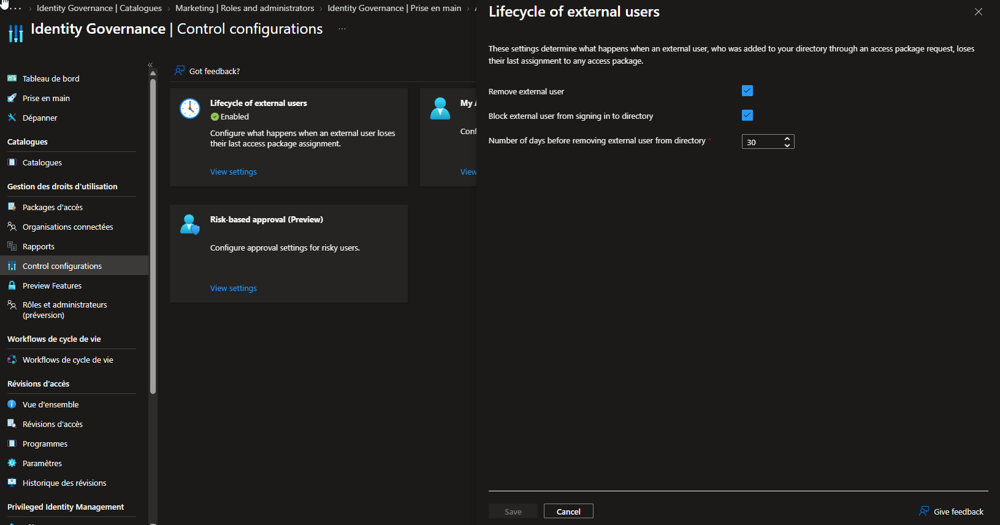

# SC-300-24 — Manage the Lifecycle of External Users

## 1. Classification

| Champ | Valeur |
|-------|--------|
| **Code** | SC-300-24 |
| **Type** | Lab de mise en œuvre — Cycle de vie des utilisateurs externes (Identity Governance) |
| **Domaine SC-300** | D4 — Gérer la gouvernance des identités (20-25%) |
| **Lab officiel** | `Lab_24_ManageTheLifecycleOfExternalUsersInAADIdentityGovernanceSettings.md` (MicrosoftLearning/SC-300) |
| **ISO 27001:2022** | A.5.16 (Gestion des identités), A.5.18 (Droits d'accès — retrait), A.8.2 (Accès privilégiés) |
| **NIS2** | Art. 21.2(i)/(d) — contrôle d'accès et sécurité de la chaîne de collaboration |
| **MITRE D3FEND** | D3-ANCI (Account lifecycle), D3-UAP (User Account Permissions) |
| **MITRE ATT&CK (contré)** | T1078.004 (Valid Accounts: Cloud) — via déprovisionnement automatique des invités |
| **Tenant** | `nchouarhipm.onmicrosoft.com` · Entra ID **P2** / Entra ID Governance |
| **Auteur** | hik3nR00t |
| **Date** | 04/08/2026 |

---

## 2. Contexte & scénario — MediaTech Groupe SA

> *MediaTech Groupe SA collabore avec des pigistes, agences et partenaires externes invités en tant qu'utilisateurs invités (guests). Problème récurrent : ces comptes restent actifs des mois après la fin de la collaboration — comptes orphelins, surface d'attaque, non-conformité. Le RSSI veut un déprovisionnement automatique : quand un invité perd son dernier accès (access package), il est bloqué puis supprimé après une période définie.*

Ce lab configure le **cycle de vie automatique des invités** : blocage de connexion + suppression après 30 jours à la perte du dernier access package.

---

## 3. Résumé exécutif

### Pour un recruteur
Configuration du déprovisionnement automatique des utilisateurs externes dans Microsoft Entra Identity Governance : lorsqu'un invité perd sa dernière attribution d'access package, il est automatiquement bloqué puis son compte est supprimé après une période définie. Cela élimine les comptes invités orphelins — un angle mort classique de sécurité et de conformité.

### Pour un auditeur ISO 27001 / NIS2
- **A.5.16 (Gestion des identités)** : le cycle de vie complet de l'identité invitée est géré (invitation → accès → retrait automatique).
- **A.5.18 (Droits d'accès — retrait)** : suppression automatique des accès et du compte à la fin de la collaboration.
- **NIS2 Art. 21.2(d)** : sécurité de la chaîne de collaboration/fournisseurs (les invités ne restent pas actifs indéfiniment).
- **Automatisation** : pas de dépendance à un processus manuel d'offboarding.
- **Traçabilité** : blocage puis suppression après N jours = piste d'audit prévisible.

### Pour un RSSI
Les comptes invités orphelins sont une porte dérobée persistante (T1078.004). Ce contrôle ferme ce risque de façon automatique et déterministe : perte d'accès → blocage → suppression à J+30. Le délai de grâce (30 j) évite les suppressions accidentelles tout en bornant l'exposition. S'applique aux invités provisionnés via **access packages** (Entitlement Management) — d'où l'importance d'onboarder les invités par ce canal gouverné.

---

## 4. Objectif & périmètre

Configurer le **cycle de vie des utilisateurs externes** pour qu'un invité, à la perte de son dernier access package :
1. soit **bloqué** de la connexion au répertoire ;
2. soit **supprimé** après **30 jours**.

**Hors périmètre** : provisionnement des invités (SC-300-05), access packages self-service, workflows de cycle de vie (Lifecycle Workflows — connexe), access reviews des invités (SC-300-25).

---

## 5. Prérequis

- Licence **Entra ID P2** / **Entra ID Governance**.
- Session **breakglass01** (Global Administrator).
- Le paramètre s'applique aux **invités provisionnés via access packages** (Entitlement Management).

---

## 6. Procédure de mise en œuvre

> Session **breakglass01** · `entra.microsoft.com`.

### 6.1 — Accéder aux paramètres

`Identity Governance → (Gestion des droits d'utilisation) Control configurations → Lifecycle of external users → View settings`

### 6.2 — Configurer le déprovisionnement automatique

- **Remove external user** (Supprimer l'utilisateur externe) : **Oui** (coché)
- **Block external user from signing in to directory** (Bloquer la connexion) : **Oui** (coché)
- **Number of days before removing external user from directory** : **30** (0 = immédiat)
- **Save**

État résultant : **Lifecycle of external users = Enabled**.



> Comportement Microsoft par défaut documenté : « à la perte du dernier access package, l'invité est bloqué ; après 30 jours son compte invité est supprimé ».

---

## 7. Vérification & preuves d'audit

### Checklist

```
☐ Lifecycle of external users = Enabled
☐ Block external user from signing in = Oui
☐ Remove external user = Oui
☐ Number of days = 30
☐ S'applique aux invités provisionnés via access packages
```

### Vérification Graph PowerShell (pwsh)

```powershell
Connect-MgGraph -Scopes "EntitlementManagement.Read.All"

# 1. Paramètres de cycle de vie des invités (entitlement management settings)
Get-MgEntitlementManagementSetting |
  Select-Object ExternalUserLifecycleAction,
    DurationUntilExternalUserDeletedAfterBlocked

# 2. Inventaire des invités et de leur dernière activité (angle mort à surveiller)
Get-MgUser -Filter "userType eq 'Guest'" -All `
  -Property DisplayName,UserPrincipalName,CreatedDateTime,SignInActivity |
  Select-Object DisplayName, UserPrincipalName, CreatedDateTime,
    @{n='LastSignIn';e={$_.SignInActivity.LastSignInDateTime}}
```

Attendu : `ExternalUserLifecycleAction = blockSignInAndDelete` (ou équivalent), délai = 30 jours.

---

## 8. Impact métier — MediaTech Groupe SA

### Synthèse narrative
Le déprovisionnement automatique des invités supprime une classe entière de comptes orphelins. Pour MediaTech, qui collabore avec de nombreux externes, c'est une réduction directe de la surface d'attaque et une mise en conformité sans effort manuel récurrent.

### Estimation financière (risque évité)

| Scénario | Estimation | Justification |
|---|---|---|
| Compte invité orphelin exploité | 100 000 € – 700 000 € | Accès persistant post-collaboration = porte dérobée |
| Non-conformité (comptes non revus) | 30 000 € – 200 000 € | Écart ISO/NIS2 sur la gestion des accès |
| Charge d'offboarding manuel évitée | 20 000 € – 80 000 € | Automatisation vs revue manuelle des invités |
| **Total valeur** | **150 000 € – 980 000 €** | Requiert P2/Governance |

### Impact réglementaire
- **ISO 27001 A.5.16 / A.5.18** : cycle de vie et retrait des accès invités gérés.
- **NIS2 Art. 21.2(d)** : sécurité de la chaîne de collaboration.
- **RGPD** : minimisation — pas de comptes/données au-delà du besoin.

### Top actions prioritaires
**0–24h** : (1) confirmer que tous les invités sont onboardés via **access packages** (sinon le contrôle ne s'applique pas).
**1 semaine** : (2) auditer les invités existants (dernière connexion) ; (3) migrer les invités hors access package vers un canal gouverné.
**1 mois** : (4) coupler avec des **access reviews** invités (SC-300-25) ; (5) évaluer les **Lifecycle Workflows** pour joiner/mover/leaver.

### Décisions attendues du COMEX
- Valider le **délai de suppression** (30 j vs immédiat).
- Imposer l'**onboarding des invités par access packages** (condition du contrôle).
- Financer **Entra ID Governance** (+ abonnement Azure pour la facturation des invités).

---

## 9. Détection SOC / SIEM

### Signaux clés

| Source | Signal | Usage |
|---|---|---|
| `AuditLogs` | `Delete external user` / guest removal | Suppression automatique |
| `AuditLogs` | Block guest sign-in | Blocage suite à perte d'access package |
| `AuditLogs` | Update entitlement management settings | Modification du paramètre (anti-tamper) |
| `SigninLogs` | Guest sign-in après collaboration terminée | Anomalie (invité qui aurait dû être bloqué) |

### Requêtes KQL

```kql
// 1. Invités actifs sans connexion récente (candidats orphelins)
SigninLogs
| where UserType == "Guest"
| summarize LastSignIn = max(TimeGenerated) by UserPrincipalName
| where LastSignIn < ago(60d)
| sort by LastSignIn asc
```

```kql
// 2. Suppressions/blocages d'invités (cycle de vie en action)
AuditLogs
| where TargetResources has "Guest" or ActivityDisplayName has_any ("Delete user","Disable account")
| where TargetResources[0].userType == "Guest"
| project TimeGenerated, ActivityDisplayName,
          Target = tostring(TargetResources[0].userPrincipalName)
| sort by TimeGenerated desc
```

```kql
// 3. Modification du paramètre de cycle de vie (anti-tamper)
AuditLogs
| where LoggedByService contains "Entitlement"
| where ActivityDisplayName has "settings"
| project TimeGenerated, ActivityDisplayName,
          Actor = tostring(InitiatedBy.user.userPrincipalName)
```

---

## 10. Pièges rencontrés (terrain)

- **S'applique uniquement aux invités provisionnés via access packages** : un invité ajouté manuellement (hors Entitlement Management) n'est pas géré par ce paramètre — sauf s'il avait initialement été invité via access package.
- **Pas de mur de licence sur CE réglage** : contrairement à la gouvernance des invités dans un catalogue (SC-300-22, qui affichait « Azure subscription required »), la config du cycle de vie s'ouvre et s'enregistre normalement.
- **Save grisé = déjà enregistré** : si les valeurs sont déjà celles voulues, le bouton reste grisé (pas un bug).
- **Délai de grâce 30 j** : le compte n'est pas supprimé immédiatement — bloqué d'abord, supprimé à J+30 (0 = immédiat).
- **Blocage vs suppression** : deux actions distinctes, activables indépendamment.

---

## 11. Durcissement continu

- **Onboarder tous les invités via access packages** (condition d'application du contrôle).
- Coupler avec des **access reviews** récurrentes sur les invités (SC-300-25).
- Auditer périodiquement les invités **sans connexion récente** (candidats à retirer manuellement s'ils sont hors access package).
- Évaluer les **Lifecycle Workflows** pour automatiser joiner/mover/leaver (internes et externes).
- Surveiller la **modification** du paramètre de cycle de vie (anti-tamper).

> Cross-ref audit PowerShell : [`m365-admin-toolkit`](https://github.com/hikenroot/m365-admin-toolkit) — inventaire des invités, dernière connexion, comptes orphelins. Cross-ref : [`ad-hardening-baseline`](https://github.com/hikenroot/ad-hardening-baseline).

---

## 12. Points d'examen SC-300

- **Cycle de vie des invités** : à la perte du **dernier access package**, l'invité est **bloqué** puis **supprimé après N jours**.
- Deux actions indépendantes : **Block sign-in** et **Remove external user**.
- Délai par défaut = **30 jours** (0 = immédiat).
- S'applique aux invités **provisionnés via Entitlement Management** (access packages).
- Réglage dans **Identity Governance → Control configurations → Lifecycle of external users**.
- Complète les **access reviews** (revue) et le **provisioning** B2B (invitation).
- Requiert **P2 / Entra ID Governance**.

---

## 13. Références

- Study Guide SC-300 — « Plan and implement entitlement management / manage guest lifecycle ».
- Lab officiel : `Lab_24_ManageTheLifecycleOfExternalUsersInAADIdentityGovernanceSettings` — MicrosoftLearning/SC-300 · [github.io](https://microsoftlearning.github.io/SC-300-Identity-and-Access-Administrator/Instructions/Labs/Lab_24_ManageTheLifecycleOfExternalUsersInAADIdentityGovernanceSettings%20.html)
- Docs : Manage the lifecycle of external users · Entitlement management settings · Govern the employee and guest lifecycle.
- Toolkits : [`m365-admin-toolkit`](https://github.com/hikenroot/m365-admin-toolkit) · [`ad-hardening-baseline`](https://github.com/hikenroot/ad-hardening-baseline)

---

*Write-up HikenRoot Forge — SC-300-24 — hik3nR00t — 04/08/2026*
