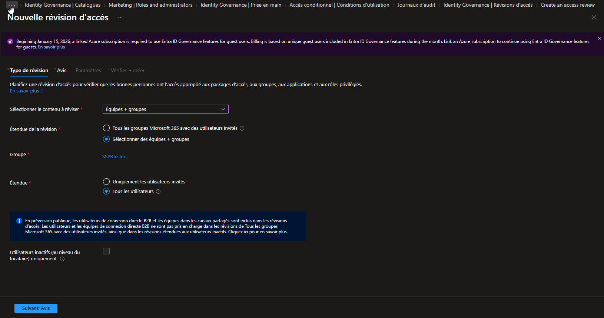
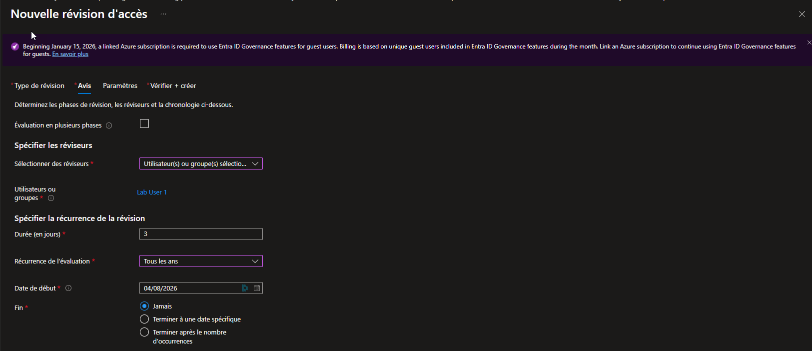
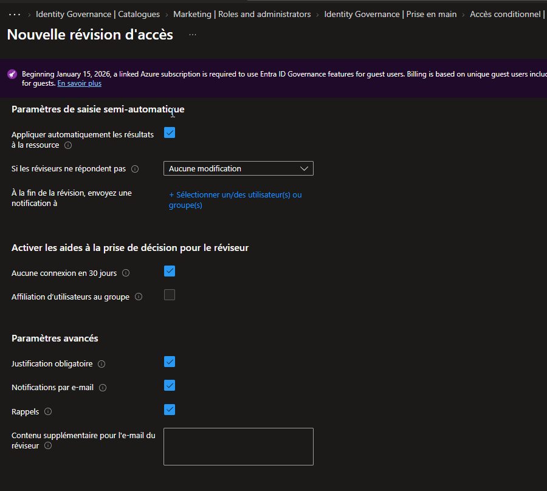
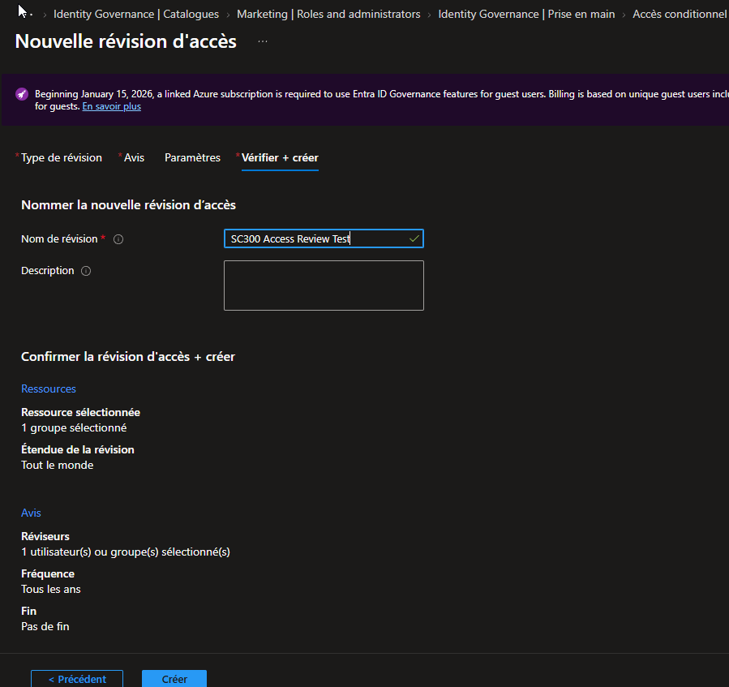
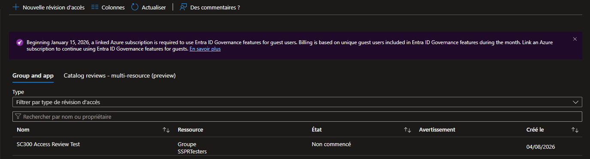

# SC-300-25 — Creating Access Reviews for Internal and External Users

## 1. Classification

| Champ | Valeur |
|-------|--------|
| **Code** | SC-300-25 |
| **Type** | Lab de mise en œuvre — Revues d'accès (Identity Governance) |
| **Domaine SC-300** | D4 — Gérer la gouvernance des identités (20-25%) |
| **Lab officiel** | `Lab_25_CreatingAccessReviewsForUsers.md` (MicrosoftLearning/SC-300) |
| **ISO 27001:2022** | A.5.18 (Droits d'accès — revue), A.5.15 (Contrôle d'accès), A.8.2 (Accès privilégiés) |
| **NIS2** | Art. 21.2(i) — contrôle d'accès et recertification périodique |
| **MITRE D3FEND** | D3-UAP (User Account Permissions), D3-ACH (Access Control Hardening) |
| **MITRE ATT&CK (contré)** | T1078 (Valid Accounts) — via retrait des accès obsolètes/excessifs |
| **Tenant** | `nchouarhipm.onmicrosoft.com` · Entra ID **P2** / Entra ID Governance |
| **Auteur** | hik3nR00t |
| **Date** | 04/08/2026 |

---

## 2. Contexte & scénario — MediaTech Groupe SA

> *MediaTech Groupe SA accumule des accès qui ne sont jamais retirés : collaborateurs qui changent de poste, membres de groupes projet terminés, invités inactifs. Le RSSI veut instaurer une recertification périodique : à intervalle régulier, un responsable atteste que chaque membre d'un groupe doit toujours y avoir accès — sinon l'accès est retiré automatiquement. Objectif : « les accès inutiles et privilégiés doivent être supprimés ».*

Ce lab crée une **revue d'accès récurrente** sur un groupe, avec relecteur désigné, aides à la décision et **application automatique** des résultats.

---

## 3. Résumé exécutif

### Pour un recruteur
Mise en place d'une revue d'accès (Access Review) récurrente dans Microsoft Entra Identity Governance : un relecteur atteste périodiquement de la pertinence des accès d'un groupe, et les décisions sont appliquées automatiquement. C'est le contrôle qui garantit que les accès ne s'accumulent pas indéfiniment — recertification continue et least privilege dans le temps.

### Pour un auditeur ISO 27001 / NIS2
- **A.5.18 (Revue des droits d'accès)** : recertification périodique formalisée (annuelle ici), avec preuve d'attestation.
- **A.5.15 / A.8.2** : maintien du moindre privilège dans le temps ; suppression automatique des accès non attestés.
- **NIS2 Art. 21.2(i)** : contrôle d'accès continu, pas figé à l'attribution.
- **Aides à la décision** : le relecteur voit l'inactivité (« aucune connexion en 30 jours ») → décision éclairée.
- **Auto-application** : les décisions sont appliquées automatiquement (pas de retard de mise en œuvre).

### Pour un RSSI
Les access reviews transforment le contrôle d'accès d'un acte ponctuel (à l'attribution) en processus continu. La récurrence annuelle + l'auto-application garantissent qu'un accès non justifié finit par être retiré sans intervention manuelle. Couplé au cycle de vie des invités (SC-300-24) et à l'entitlement management (SC-300-22), on obtient une gouvernance complète : accès demandé, gouverné, revu, expiré.

---

## 4. Objectif & périmètre

Créer une **revue d'accès récurrente** sur le groupe `SSPRTesters`, avec :
- relecteur désigné (labuser1) ;
- récurrence **annuelle** ;
- **aide à la décision** sur l'inactivité (30 j) ;
- **application automatique** des résultats.

**Hors périmètre** : revues d'access packages, revues de rôles PIM (connexe SC-300 PIM), revues multi-ressources (catalog reviews), exécution effective de la revue (déclenchée à la date de début).

---

## 5. Prérequis

- Licence **Entra ID P2** / **Entra ID Governance**.
- Session **breakglass01** (Global Administrator).
- Un groupe cible existant : `SSPRTesters` (labuser1, labuser2).
- Un relecteur : labuser1.

---

## 6. Procédure de mise en œuvre

> Session **breakglass01** · `entra.microsoft.com`.

### 6.1 — Type de révision (portée)

`Identity Governance → Révisions d'accès → + Nouvelle révision d'accès → Resource review`
- **Sélectionner le contenu à réviser** : **Équipes + groupes**
- **Étendue de la révision** : Sélectionner des équipes + groupes → **SSPRTesters**
- **Étendue** : **Tous les utilisateurs**



### 6.2 — Avis (relecteurs + récurrence)

- **Sélectionner des réviseurs** : Utilisateur(s) sélectionné(s) → **Lab User 1**
- **Durée** : 3 jours
- **Récurrence de l'évaluation** : **Tous les ans** (Annuelle)
- **Date de début** : 04/08/2026 · **Fin** : Jamais



### 6.3 — Paramètres (auto-application + aides à la décision)

- **Appliquer automatiquement les résultats à la ressource** : **Activé**
- **Si les réviseurs ne répondent pas** : **Aucune modification** (safe sur un groupe partagé ; en prod → *Supprimer l'accès* pour un nettoyage automatique)
- **Aides à la décision → Aucune connexion en 30 jours** : Activé (le relecteur voit les inactifs)
- **Justification obligatoire**, **Notifications e-mail**, **Rappels** : Activés



### 6.4 — Vérifier + créer

- **Nom** : `SC300 Access Review Test`
- Récapitulatif : 1 groupe (SSPRTesters), étendue Tout le monde, 1 réviseur, fréquence annuelle, pas de fin.



Résultat : la revue **SC300 Access Review Test** apparaît dans la liste (état *Non commencé* → démarrera à la date de début).



---

## 7. Vérification & preuves d'audit

### Checklist

```
☐ Revue SC300 Access Review Test créée sur SSPRTesters
☐ Relecteur = Lab User 1
☐ Récurrence = Annuelle
☐ Auto-application des résultats = Activé
☐ Aide à la décision « aucune connexion 30 j » = Activé
☐ Justification + notifications + rappels = Activés
```

### Vérification Graph PowerShell (pwsh)

```powershell
Connect-MgGraph -Scopes "AccessReview.Read.All"

# 1. La définition de la revue d'accès
Get-MgIdentityGovernanceAccessReviewDefinition -Filter "displayName eq 'SC300 Access Review Test'" |
  Select-Object DisplayName, Status,
    @{n='Recurrence';e={$_.Settings.Recurrence.Pattern.Type}},
    @{n='AutoApply';e={$_.Settings.AutoApplyDecisionsEnabled}},
    @{n='DefaultDecision';e={$_.Settings.DefaultDecision}}

# 2. Instances et décisions (après démarrage de la revue)
$def = Get-MgIdentityGovernanceAccessReviewDefinition -Filter "displayName eq 'SC300 Access Review Test'"
Get-MgIdentityGovernanceAccessReviewDefinitionInstance -AccessReviewScheduleDefinitionId $def.Id |
  Select-Object Status, StartDateTime, EndDateTime
```

Attendu : `Recurrence = annual`, `AutoApply = true`, `DefaultDecision = None` (aucune modification si non-réponse).

---

## 8. Impact métier — MediaTech Groupe SA

### Synthèse narrative
Les revues d'accès instaurent une recertification continue : les accès sont réattestés régulièrement, les accès obsolètes retirés automatiquement. Pour MediaTech, c'est la fin de l'accumulation silencieuse de droits — un pilier de conformité et de réduction de surface d'attaque.

### Estimation financière (risque évité)

| Poste | Estimation annuelle | Justification |
|---|---|---|
| Accès excessifs/obsolètes exploités | 150 000 € – 900 000 € | Least privilege maintenu dans le temps |
| Non-conformité (défaut de revue) | 40 000 € – 250 000 € | Recertification exigée par ISO/NIS2 |
| Charge de revue manuelle évitée | 30 000 € – 120 000 € | Automatisation + auto-application |
| **Total valeur** | **220 000 € – 1 270 000 €** | Requiert P2/Governance |

### Impact réglementaire
- **ISO 27001 A.5.18** : revue périodique des droits d'accès documentée.
- **NIS2 Art. 21.2(i)** : contrôle d'accès continu.
- **RGPD** : minimisation — accès limités au strict nécessaire dans la durée.

### Top actions prioritaires
**0–24h** : (1) identifier les groupes/rôles critiques à revoir en priorité.
**1 semaine** : (2) créer des revues sur les **groupes privilégiés** et les **rôles PIM** ; (3) désigner les bons relecteurs (propriétaires métier).
**1 mois** : (4) passer « si non-réponse » sur **Supprimer l'accès** pour le nettoyage automatique ; (5) coupler avec l'entitlement management et le cycle de vie des invités.

### Décisions attendues du COMEX
- Valider la **cadence de recertification** (annuelle vs trimestrielle pour les accès sensibles).
- Arbitrer la politique **« non-réponse = suppression »** (sécurité vs continuité).
- Désigner les **relecteurs responsables** par périmètre.

---

## 9. Détection SOC / SIEM

### Signaux clés

| Source | Signal | Usage |
|---|---|---|
| `AuditLogs` | `Create access review` | Création d'une revue |
| `AuditLogs` | `Apply access review decision` | Application des décisions (retrait d'accès) |
| `AuditLogs` | Décision « Deny » appliquée | Accès retiré suite à revue |
| `AuditLogs` | Modification d'une revue | Altération de la gouvernance (anti-tamper) |

### Requêtes KQL

```kql
// 1. Décisions de revue appliquées (retraits d'accès)
AuditLogs
| where LoggedByService contains "Access Review"
| where ActivityDisplayName has_any ("Apply","decision")
| project TimeGenerated, ActivityDisplayName,
          Target = tostring(TargetResources[0].displayName)
| sort by TimeGenerated desc
```

```kql
// 2. Revues non complétées (relecteurs qui ne répondent pas)
AuditLogs
| where LoggedByService contains "Access Review"
| where ActivityDisplayName has "reminder" or ActivityDisplayName has "not reviewed"
| summarize count() by bin(TimeGenerated, 1d)
```

```kql
// 3. Modification/suppression d'une revue (anti-tamper gouvernance)
AuditLogs
| where LoggedByService contains "Access Review"
| where ActivityDisplayName has_any ("Update","Delete")
| project TimeGenerated, ActivityDisplayName,
          Actor = tostring(InitiatedBy.user.userPrincipalName)
```

---

## 10. Pièges rencontrés (terrain)

- **Nouvelle blade à modèles** : la création passe par « Resource review » vs « Catalog review » (multi-ressources) — choisir Resource review pour un groupe.
- **Bandeau Azure subscription pour invités** : la revue de groupes avec **invités** nécessite un abonnement Azure lié (facturation à partir du 15/01/2026) ; sur un groupe sans invités (SSPRTesters) ça passe sans.
- **Auto-application ≠ décision par défaut** : « Appliquer automatiquement » applique les décisions du relecteur ; « Si non-réponse » définit ce qui se passe **sans** décision (Aucune modification / Supprimer / Recommandations).
- **Aide « aucune connexion 30 j »** : très utile mais c'est un **indicateur**, pas une décision automatique — le relecteur reste décideur.
- **État « Non commencé »** : la revue démarre à la **date de début**, pas immédiatement.

---

## 11. Durcissement continu

- Étendre les revues aux **groupes privilégiés**, **rôles d'annuaire (via PIM)** et **access packages**.
- Passer « non-réponse » sur **Supprimer l'accès** pour un nettoyage automatique (après phase de rodage).
- Raccourcir la **cadence** pour les accès sensibles (trimestrielle).
- Désigner des **relecteurs métier** (propriétaires), pas uniquement l'IT.
- Combiner avec **entitlement management** (SC-300-22) et **cycle de vie des invités** (SC-300-24) pour une gouvernance de bout en bout.

> Cross-ref audit PowerShell : [`m365-admin-toolkit`](https://github.com/hikenroot/m365-admin-toolkit) — export des revues d'accès et de leurs décisions. Cross-ref : [`ad-hardening-baseline`](https://github.com/hikenroot/ad-hardening-baseline).

---

## 12. Points d'examen SC-300

- **Access review** = recertification périodique des accès (groupes, apps, rôles, access packages).
- **Relecteurs** : utilisateurs sélectionnés, **propriétaires du groupe**, ou **auto-revue** (l'utilisateur atteste lui-même).
- **Récurrence** : une fois / hebdo / mensuelle / trimestrielle / semestrielle / annuelle.
- **Auto-apply** : applique les décisions automatiquement à la fin.
- **Si non-réponse** : Aucune modification / **Supprimer l'accès** / Prendre les recommandations.
- **Aides à la décision** : dernière connexion (30 j), affiliation au groupe.
- Revues de **rôles privilégiés** = via **PIM** (le message « les accès privilégiés inutiles doivent être supprimés »).
- Requiert **P2 / Entra ID Governance** ; invités → abonnement Azure lié.

---

## 13. Références

- Study Guide SC-300 — « Plan and implement access reviews ».
- Lab officiel : `Lab_25_CreatingAccessReviewsForUsers` — MicrosoftLearning/SC-300 · [github.io](https://microsoftlearning.github.io/SC-300-Identity-and-Access-Administrator/Instructions/Labs/Lab_25_CreatingAccessReviewsForUsers.html)
- Docs : Create an access review of groups and applications · Review recurrence and auto-apply · Access reviews for PIM roles.
- Toolkits : [`m365-admin-toolkit`](https://github.com/hikenroot/m365-admin-toolkit) · [`ad-hardening-baseline`](https://github.com/hikenroot/ad-hardening-baseline)

---

*Write-up HikenRoot Forge — SC-300-25 — hik3nR00t — 04/08/2026*
