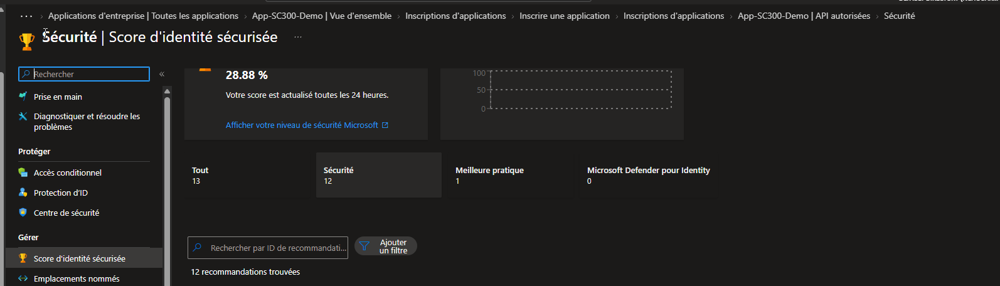

# SC-300-28 — Suivi de la posture via Identity Secure Score

## Classification

| Champ | Valeur |
|-------|--------|
| **Code scénario** | SC-300-28 |
| **Nom** | Mesure et suivi de la posture de sécurité identité (Identity Secure Score) |
| **Type** | 🛡️ Défensif — Gouvernance & monitoring de posture (Entra ID) |
| **Environnement** | Tenant Microsoft Entra `nchouarhipm.onmicrosoft.com` |
| **Domaine SC-300** | Monitoring & posture (transversal) |
| **Module Entra** | Protection · Identity Secure Score |
| **Criticité opérationnelle** | 🟡 Modérée (pilotage de la posture) |
| **Contrôles ISO 27001** | A.5.36 (Conformité), A.8.8 (Gestion des vulnérabilités techniques) |
| **Exigences NIS2** | Art. 21.2(a) — analyse de risque et posture de sécurité |
| **MITRE D3FEND** | (transversal — pilotage défensif) |
| **Réf. lab SC-300** | `Lab_28_MonitorPostureWithIdentitySecureScore` |
| **Date** | Août 2026 |
| **Auteur** | hik3nR00t |

---

## Contexte & scénario

> Le RSSI de **MediaTech Groupe SA** a besoin d'un **indicateur unique** pour piloter la posture de sécurité identité du tenant et prioriser les actions de durcissement. L'**Identity Secure Score** fournit ce score (%) et une liste d'actions recommandées avec leur impact — un tableau de bord actionnable pour la gouvernance.

---

## Résumé exécutif

### Pour un recruteur

Ce write-up exploite l'**Identity Secure Score** de Microsoft Entra : lecture du score global de posture, analyse des recommandations d'amélioration priorisées, et lien avec les mesures de durcissement mises en œuvre dans les autres labs (MFA, PIM, Smart Lockout, Conditional Access).

### Pour un auditeur ISO 27001 / NIS2

L'Identity Secure Score constitue une **mesure objective et suivie de la posture** (A.8.8, NIS2 analyse de risque) : il quantifie l'écart aux bonnes pratiques Microsoft et priorise les remédiations. Le score, actualisé toutes les 24 h, offre une trace de l'amélioration continue exploitable en audit.

### Pour un RSSI

L'Identity Secure Score est l'**indicateur de pilotage** de la sécurité identité : un chiffre unique (%) pour le COMEX, une liste d'actions priorisées par gain/effort pour les équipes. Il transforme la sécurité identité en démarche mesurable et pilotable. Score observé sur ce tenant : **28,88 %** → marge de progression significative, adressée par les durcissements des autres write-ups.

---

## Objectif & périmètre

Consulter l'Identity Secure Score, analyser les recommandations, et le relier aux mesures de durcissement.

---

## Prérequis

- Rôle **Global Reader** / **Security Reader** (lecture) — aucune modification requise pour consulter.

---

## Procédure de mise en œuvre

> Session **breakglass01** (GA) — lecture seule possible avec un rôle Reader.

1. `Identité → Protection → Score d'identité sécurisée` (ou recherche « Score d'identité sécurisée »).
2. Relever le **score global** et le nombre de **recommandations**.
   
3. (Optionnel) Ouvrir une recommandation (ex. « Exiger la MFA… ») pour voir l'action, l'impact sur le score et l'état.

> **Observation :** score = **28,88 %** · **12 recommandations** (catégories : Sécurité, Meilleure pratique). Marge de durcissement importante.

---

## Vérification & preuves d'audit

```
☐ Score d'identité sécurisée consulté (%)                      → 01
☐ Recommandations listées et catégorisées                     → 01
☐ Corrélation avec les mesures des autres labs (MFA, PIM, lockout, CA)
```

---

## Impact métier — MediaTech Groupe SA

### Synthèse narrative

MediaTech dispose enfin d'un **indicateur unique** de sa posture identité. Le score bas (28,88 %) objective le besoin de durcissement, et les recommandations priorisent les chantiers (MFA, accès conditionnel, PIM). Chaque mesure appliquée dans les autres write-ups fait mécaniquement monter le score → démonstration d'amélioration continue chiffrée.

### Estimation financière

| Poste | Sans pilotage | Avec Identity Secure Score |
|-------|---------------|-----------------------------|
| Priorisation des chantiers sécurité | à l'aveugle | par gain/effort |
| Reporting COMEX | qualitatif | **indicateur chiffré suivi** |

### Impact réglementaire

NIS2 Art. 21.2(a) (analyse de risque), ISO 27001 A.8.8 / amélioration continue (Clause 10).

### Top actions (dérivées des recommandations)

- **0–24 h** : traiter les recommandations à fort gain / faible effort (MFA admins, désactiver l'auth héritée).
- **1 semaine** : Conditional Access, MFA généralisée, PIM (cf. SC-300-02/13/14).
- **1 mois** : suivre la progression du score (cible > 70 %), reporting COMEX mensuel.

### Décisions COMEX

- Fixer une **cible de score** (ex. > 70 %) et un **rythme de reporting** mensuel.
- Financer les chantiers priorisés par le score.

---

## Détection SOC / SIEM

L'Identity Secure Score n'est pas un flux d'alerte mais un **indicateur de posture**. Il se surveille via API (Microsoft Graph `security/secureScores`) pour tableau de bord et alerte sur régression.

```kusto
// Via export Graph secureScores vers Log Analytics
SecureScore_CL
| project TimeGenerated, currentScore_d, maxScore_d, percent = currentScore_d / maxScore_d * 100
| order by TimeGenerated desc
```
> Alerter si le score **régresse** (une régression = un durcissement défait ou une dérive de configuration).

---

## Durcissement continu — `m365-admin-toolkit`

| Contrôle | Script toolkit |
|----------|----------------|
| Export & suivi du Secure Score (Graph) | `audit-tenant-config` |
| Corrélation recommandations ↔ config réelle | `audit-security-policies` |

- **En continu** : suivre la tendance du score ; toute baisse = investigation.
- **Mensuel** : rapport de posture au COMEX.

---

## Points d'examen SC-300

- L'**Identity Secure Score** mesure la posture identité vs bonnes pratiques Microsoft ; actualisé toutes les **24 h**.
- Chaque recommandation a un **gain de points** et un **impact utilisateur** — prioriser par ratio gain/effort.
- Accessible en **lecture seule** avec Global/Security Reader.
- Distinct du **Microsoft Secure Score** global (qui agrège identité + apps + devices) — l'Identity Secure Score est le volet identité.

---

## Références

- [SC-300 Study Guide](https://learn.microsoft.com/en-us/credentials/certifications/resources/study-guides/sc-300)
- [Lab_28 Monitor Posture with Identity Secure Score](https://microsoftlearning.github.io/SC-300-Identity-and-Access-Administrator/Instructions/Labs/Lab_28_MonitorAndManageSecurityPostureWithIdentitySecureScore.html)
- [m365-admin-toolkit](https://github.com/hikenroot/m365-admin-toolkit)
